# GPU Driven Pipeline
*本周研讨 GPU 渲染管线，按照 [aaltonenhaar_siggraph2015_combined_final_footer_220dpi.pdf](./documents/aaltonenhaar_siggraph2015_combined_final_footer_220dpi.pdf) 的内容进行讨论*

## 目录
+ Mesh Cluster Rendering
    + Topic
    + Discussion
+ Rendering pipeline
    + Topic
    + Discussion
+ Static Triangle Backface Culling
    + 原理
    + 结果
+ GPU Occlusion Culling
    + Occlusion Depth Generation
    + Two-Phase Occlusion Culling
+ Camera Depth Reprojection
+ 总结
    + GPU Driven Pipeline总结
    + 个人感受

## Mesh Cluster Rendering
### Topic
Mesh Cluster，网格块，指把一个模型以 cluster 为单位的进行细分，如下图：

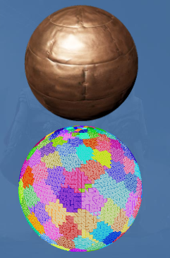

首先有几点需要说明或定义：
+ 固定的拓扑结构
    + 使用顶点带（vertex strips）组成的区域，被称为Cluster
    + 以 Assassin' Creed Unity(后面简称为AC) 为例，Cluster 固定为64个顶点，合计62个三角形（triangle strips）
+ 拆分和重排所有模型网格进 Cluster 里
    + 不足64个顶点，会插入 degenerate triangles 来将这个部分补齐到64个顶点
+ 需要我们自己在 VS 阶段从共享缓冲中获取顶点信息
    + 根据 Instance Id 和 Cluster Index 去索引得到需要的顶点数据
+ 使用间接绘制去按照 Cluster 的粒度进行绘制
    + 不再使用 DrawInstance 去绘制，转而使用 DrawInstancedIndirect
    + 使用间接绘制可以直接让我们在一个 drawcall 里绘制出任意数量的模型，而不必要去按不同 Instance 去绘制
+ Cluster 的剔除和绘制需要的信息都转到了 GPU 里进行，减少CPU的参与

我们通过 Mesh Cluster 能得到什么？
+ 一个 drawcall 画世界，可以使用一个 dc 绘制出任意数量的 meshes
+ 以 Cluster 的粒度（更小的粒度）进行GPU剔除
    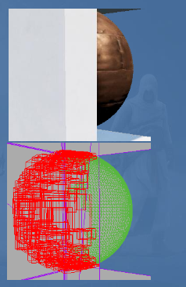
+ 更快的顶点信息获取
+ 对 Cluster 进行深度排序
+ 使用 triangle strips 带来的问题
    + 当前划分的 Cluster ，顶点数量不够时，需要额外生成 degenerate triangles，这会增加内存消耗
    + 不确定的 Cluster 顺序，会造成 z-fighting（z 冲突）
+ 使用 MultiDrawInstancedIndirect 可以有效减缓上面的问题
    + GPU 内每个 sub-drawcall 负责绘制一个 Instance，Cluster 的绘制粒度过小

*第 5和 6点说得不是很清楚，我这里的理解是，使用间接绘制方法按 Cluster 的粒度去做绘制，在所有场景都挺有效的，但是对于 ACU 来说，会有一些问题。第一点，模型较多，需要补齐的没有64个顶点的 Cluster 比较多，补齐产生了很多额外数据，游戏使用会有很多内存上的压力；第二点，不定顺序的 Cluster 会和一些没有对齐的建筑模型发生 z冲突。他们的解决方法是，改成了 MultiDrawInstancedIndirect 的方式进行 drawcall 的命令提交，改变有两点，第一点，一个 sub-drawcall 就对应一个 Instance，把绘制的最小粒度提升了；第二点，把 Cluster 的64个固定的顶点数量，改为了64个三角形，将Cluster放大了一点。绘制粒度提升主要解决了 z冲突，Cluster 的大小提升主要减少了划分 Cluster 时需要生成的数据的量。由于变成了 Instance 的绘制粒度，绘制过程中就需要维护 index buffer。*

### Discussion
优点：
+ 提高剔除效率
    细化了剔除的粒度，如果一个模型部分遮挡，那么按照 Cluster 进行剔除，就能把遮挡的部分给剔除掉
+ 按照 wavefront（GPU调度的基本单位） 的大小去划分 Cluster，提高绘制的效率
+ Cluster 流式加载，减少加载时的压力
    模型细化成了 Cluster，粒度小了，不必一次性需要加载完整的模型，一块一块的加载也是可行的
    这里也配合了 GPU 按照 Cluster 的粒度进行绘制的想法，一个大模型不必等到完整数据加载后才进行绘制，只加载和绘制了需要的部分也是可以的

缺点：
+ Cluster 生成会产生额外数据，导致模型数据变大

个人看法：
+ Cluster 是对模型做了细化，把这个做细化的过程放到了数据处理阶段（提前烘焙得到），在我们的动态阶段，直接使用已经处理好的数据是非常节省时间的
    就我看来，可以尽可能多的优化管线，把可以做静态计算的部分给规划出来，动态阶段直接用是比较好的
+ 剔除的粒度是不是越小越好
    + 小粒度剔除是可以做到精细，剔除率高，绘制数量减少等
    + 但是剔除粒度越小，表明剔除的这个过程计算量越大，这里要考虑负优化问题

## Rendering pipeline
### Topic
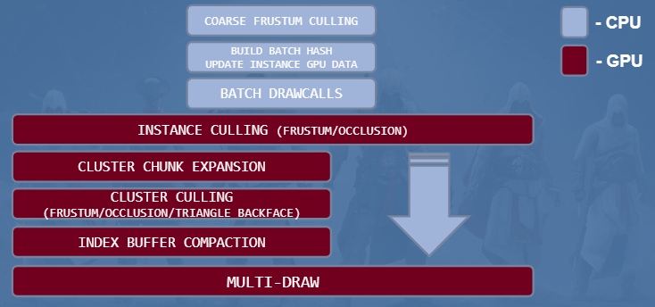
整个管线被分为 CPU 阶段和 GPU 阶段
这里简单说一下 CPU 的工作内容：
+ 视锥剔除（Frustum Culling)，剔除粒度应该是 Mesh 或者是 Instance
    使用四叉树剔除，粗略的先在 CPU 处理模型数据时，把视锥外的模型给剔除掉
+ 材质合批，准备 GPU 使用的 Instance 的数据
+ Drawcall 合批
    使用间接绘制，通过一个 drawcall 传递需要绘制参数（最少一个，也可能合批成好多个）

接下来按步骤，细讲一下 GPU 的工作内容：
+ Instance Culling(Frustum/Occlusion)
    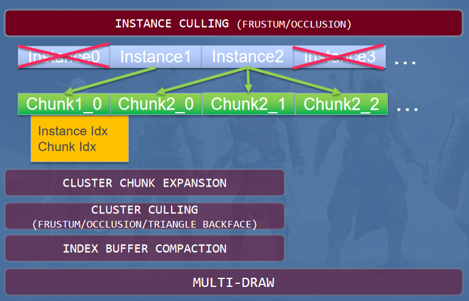
    根据缓冲区拿到的每个实例的信息（变换、边界等）做剔除（视锥和遮挡剔除），然后生成可见的 Chunk 列表
    *对于一个模型来说，以 64为固定大小的 Cluster应该粒度太小了，Chunk应该就是中间的层次结构，Mesh-Chunk-Cluster这样类似的层级结构*
+ Cluster Chunk Expansion
    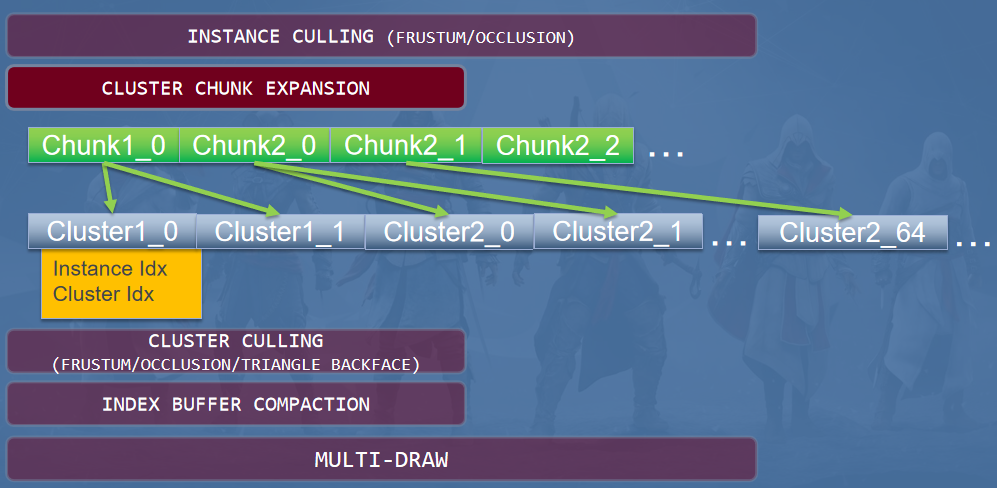
    把 Chunk 列表给展开成 Cluster 列表
    *这里指出了为什么不能直接展开成 Cluster列表，而是要通过 Chunk做中转。一个 mesh可以分成的 Cluster太多（0-1000~），如果直接这样去让 GPU展开，那么 Cluster的数量对于 GPU的 wavefront来说，不能使线程间达到大致平衡（不同线程间差距过大，无法进行 GPU优化）。这里把中间层级约束到了 Chunk，最大可以包含 64个 Cluster。*
+ Cluster Culling
    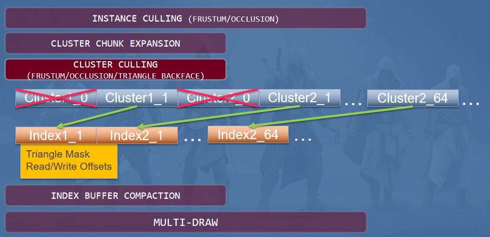
    根据 Cluster的信息（变换、边界等）做剔除（视锥和遮挡剔除），然后为每个 Cluster计算三角形背面剔除掩码（采样预先烘焙好的根据方向计算的三角形背面遮挡数据），把 Cluster剔除信息和三角形背面剔除掩码传递到下一个阶段，做 indexbuffer 压缩。
    *这里的 Triangle Mask是三角形背面剔除的采样结果，我们预先将三角形各个方向的可见性做了烘焙处理，存进 Cluster的信息里面，这里计算当前这个方向是否为背面，然后写入掩码即可。后文会展示如何烘焙三角形背面数据。*
+ Index Buffer Compaction
    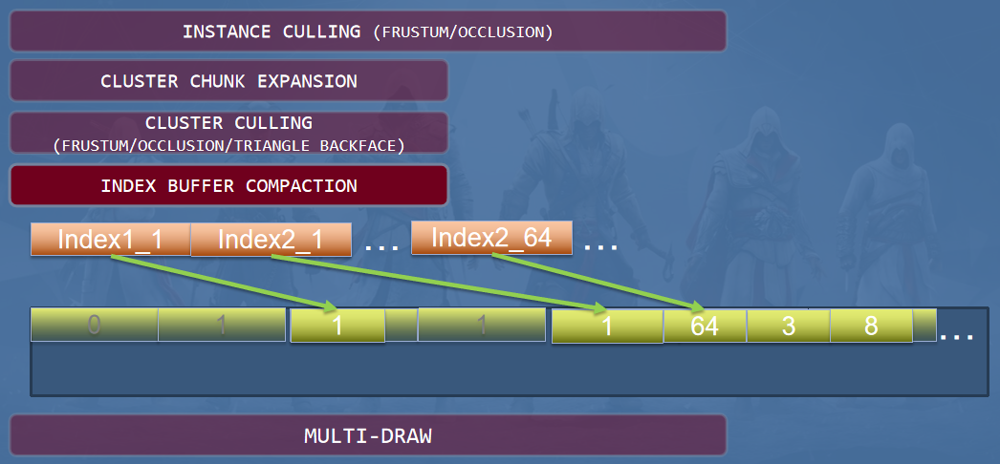
    Indexbuffer 是跟着 Drawcall 一起传入 GPU 中的，它记录了所有实例的下标，这里我们根据 Cluster剔除信息和三角形背面剔除掩码将已经被剔除的 Cluster的下标以及背面剔除的三角形的下标给删除掉，把 Indexbuffer 压缩到只含有需要绘制的三角形下标。
    这里有两个点比较特殊：
    + 被压缩的 Indexbuffer 比较小（小于8mb），这样会让我们不能一次性处理非常大的 renderpass，我们必须把它分成多个 pass 来进行。这意味着，Indexbuffer 的压缩和 multi-draw 是交替进行的，不会发生所有的 Indexbuffer压缩完成才进行绘制。
    + 一个 wavefront 只会处理一个 Cluster 的 Indexbuffer 压缩计算，每个线程也就只能处理一个单独的三角形，不会和其他 wavefront 和线程有耦合。
+ Multi-Draw
    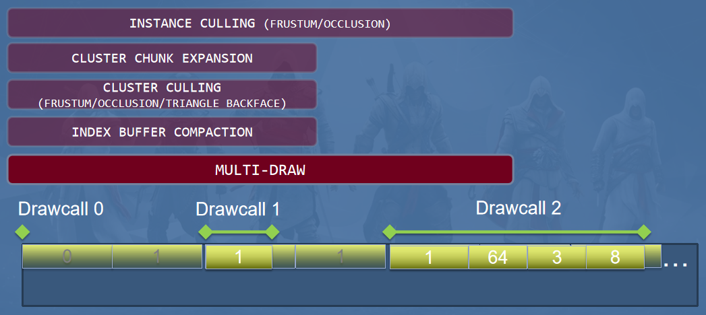
    这里使用 MultiDrawIndexInstancedIndirect 来绘制前几个步骤生成的 drawcall组。

### Discussion
优点：
+ 将模型从 Mesh 的粒度进一步细分为 Cluster，为管线其他阶段提高效率
+ 非常巧妙的把提高精度（比如绘制粒度更小，剔除粒度更小，加载粒度更小等等），提前处理模型，生成 Cluster，把提升精度的消耗放到了 Runtime 之外
+ 更加细致的 GPU剔除，剔除效率提高，能剔除掉更多的东西，也给大模型的部分遮挡，给出了一个较好的解决办法
+ CPU 与 GPU 通信的次数和内容大小都降低了，CPU 的很多工作都挪到了 GPU去做，变相的释放了 CPU性能，去做游戏需要的逻辑处理，以及物理、动画、模拟都可以重新进行优化
+ 应该还有一些细节，我没记录下来，也没能想到（如果想到了再补充）

缺点：
+ 核心就是 Cluster，现在把 Mesh细分为 Cluster，就要想到这么几个问题，如何进行细分（不同顶点数的 Cluster细分策略不一样，顶点数应该这么确认，边缘如何处理，不足数量时新增顶点的策略），Cluster 该如何进行管理等等
+ GPU Driven 管线必须和当前的管线并行了，不适合共用（这里指引擎需要有两套甚至多套不同的管线），现行的管线和 GPU 管线差异挺大，适配是个问题
+ GPU 管线对 GPU 的负担具体有多大，尽管当前30系N卡和60系A卡挺强的，但是主流游戏市场主流的显卡仍然是1060级别
+ 感觉 GPU Driven Pipeline 并没有什么特别的缺点，上面说的这些问题，仅仅是我考虑实际生产环境，没有多余人力物力来推动这个新管线落地而想到的一些困难点。如果有专门的人或者小团队去推的话，应该也不算什么大问题。可能游戏项目实际用起来这个管线还要一段时间，稳定性和泛用性都需要花时间去打磨，引擎维护也需要考虑人力。
+ 写代码比较繁琐，GPU 侧的代码量大增（感觉），本来管线就复杂，还要在 shader 里面写，可能就更恼火了
+ 定位问题同样是个大坑，手段不多，而且还麻烦，转到多物体的 GPU 管线绘制，复杂程度直线上升

个人看法：
+ GPU Driven Pipeline 优点非常明显，且这两年技术和条件都相对成熟一些了，适合作为后续个人技术积累和研究的方向
+ 如果不打算新增这个管线，也应该在当前管线上尽可能的使用 GPU管线的一些功能（可以魔改使用），算是预研 GPU管线，记录一些痛点和难点，为后续接入积累经验

## Static Triangle Backface Culling
这一节详细说一下为三角形烘焙背面剔除的可见性数据的过程
*分享中讲了 ACU 的做法和结果，我这里讲一下本质的原理，以及他们是如何做简化和优化的*

### 原理
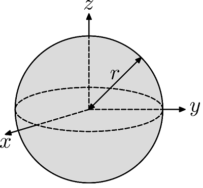
*找的网图，后面有时间可以重新画一个贴合场景的图*
#### 烘焙计算的原理
+ 原点表示三角形的位置
+ 球上任意一点和原点的连线表示相机的朝向（lookat）
+ 这个方向上是否看到三角形背面和球面的坐标做一一对应，得到球面函数：$
f(x, y, z) =
\begin{cases}
   1 &\text{if not backface} \\
   0 &\text{if backface}
\end{cases}$

这些数据我们在烘焙阶段就计算生成好了，在实际三角形背面剔除计算时，直接根据三角形的中心坐标和相机的朝向去获取结果即可

#### 简化与优化
+ 我们不必去存球面关系，而是直接将计算出来的值映射到 cubemap 中，方便存储、加载和采样
+ ACU 做了一个极致的简化，将球面表示的任意方向简化为立方体六个面的朝向，我们只计算存储 $x, -x, y, -y, z, -z$ 这6个方向上，三角形的背面可见性
    + 首先是数据量的问题，每个三角形只有6个0或1的数据，那么只有6个bit就能表示一个三角形（ACU使用64个三角形，那么对于每个 Cluster来说，最多64*6 bit的数据量）
    + 其次是计算的复杂度，在烘焙过程中，只考虑6个方向，极大的简化计算和存储
    + 只有6个bit来表示任意方向上的三角形可见性，那么结果必然不会很准确。
    这里采用了保守剔除策略：用最少的消耗，在准确的条件下，剔除不需要的三角形，提升效率
        对于任意方向来说，6bit的 cubemap采样出的结果：$
        result = \begin{cases}
            1 &\text{可能不可见} \\
            0 &\text{一定不可见}
        \end{cases}$

我们剔除那些只用6个bit就能区分出来的不可见三角形（背面表示的三角形），能剔除一些就是赚的，如果提升烘焙数据的精度，那么可能得不偿失。

### 结果
看一下 ACU 的三角形背面剔除的结果：
+ 一个三角形6个bit来存储该三角形的背面可见性，cubemap每个面只有一个像素，那么对于一个 Cluster来说，只会多 64 * 6 bits（ACU 扩展 Cluster的大小到了64个三角形）
+ 10%-30%的三角形被剔除

## GPU Occlusion Culling
分享中提到了两种 GPU 剔除策略
+ ACU 使用的是 Occlusion Depth Generation，主要分享遮挡深度的生成
+ RedLynx 使用的是 Two-Phase Occlusion Culling，主要分享遮挡剔除的过程

### Occlusion Depth Generation
#### 基本实现思路
+ Depth pre-pass，我们单独创建一个预计算 pass来生成遮挡深度图
    + 在这个 pass生成的遮挡深度图可以被后面 High-Z 和 Early-Z 使用
+ 选取一些好的遮挡物来生成本帧的深度遮挡图
    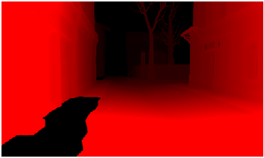
    + 有很多策略来选取好的遮挡物，ACU 这里采用最简单的基于距离的选择策略（因为时间原因，没有过多测试）
+ 将本帧深度遮挡图降采样到 $512 \times 256$
    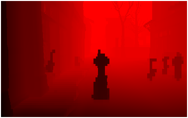
+ 上一帧的深度图重投影（reprojection）到原来的 $\dfrac {1} {16}$分辨率
    + 不知道是当前 pass做重投影；还是之前就做好了重投影，这里直接使用
    + 为什么做重投影：降低上一帧的深度的分辨率，模糊上一帧的深度信息，这一帧去大概数据，抛弃完全准确的上一帧数据，降低计算量，忽略上一帧的某些准确信息（减少我们对这种准确而跟本帧冲突的数据）
+ 将本帧遮挡深度图和上一帧的重投影遮挡深度图做一个合并
    + 为什么做合并，本帧遮挡深度是选择部分模型来做遮挡物生成深度图，很可能旋转不连续有空洞产生（镜头的边缘也容易产生）
        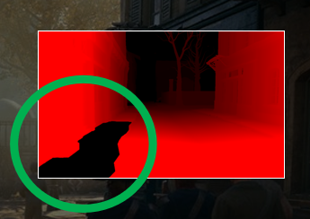
    + 我们使用上一帧的深度重投影来填满这些空洞的地方
    + 上一帧的大型移动遮挡物可能会产生错误遮挡，我们会在重投影的过程中去掉相机附近遮挡来避免这种情况的发生
+ 我们把这个生成的遮挡深度图按深度做一个分级(Depth Hierarchy)，作为后面 GPU剔除的依据（这里做mipmap？个人不确定）
    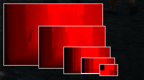

#### 生成效率
以 ACU 的典型场景为例，展示整个 pass的耗时
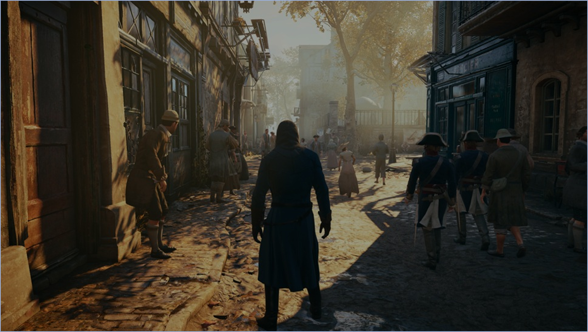
+ 300 selected occluders 生成本帧遮挡深度图 **~600us**
+ 本帧深度遮挡图降采样到 $512 \times 256$ **100us**
+ 本帧深度遮挡图与上帧深度重投影图进行合并 **50us**
+ 根据合并图生成遮挡深度分级图 **50us**

可以看到这个 pass的主要步骤耗时不超过**1ms**

#### Shadow Occlusion Depth Generation
[Shadow Occlusion Depth Generation](#shadow-occlusion-depth-generation) 是 Occlusion Depth Generation 在阴影方面的应用，在后面展开

### Two-Phase Occlusion Culling
#### 基本思路
+ 只有一个遮挡剔除 pass
    + ACU 有两个 pass，prepass 生成遮挡深度，剔除 pass 做实际的剔除
    + RedLynx 的场景更多由小物体组成，不会有单个物体的大面积遮挡
    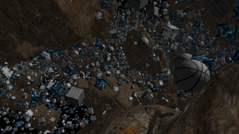
+ 基于 G-Buffer 深度数据生成一个遮挡深度锥体
    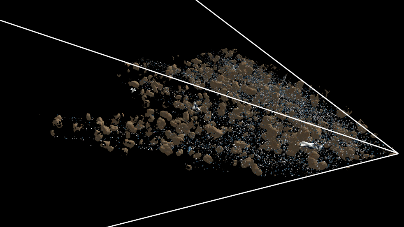
+ 深度遮挡锥是由 GCN HTILE min/max depth buffer 生成出来的
    + 比全分辨率递归采样生成快12倍
    + 这里没听说过 GCN HTILE min/max depth buffer，所以不会
+ 对遮挡物体做遮挡测试
    + O(1) 级别的测试
    + 使用 gather4 指令，一次测试把4个遮挡物合在一起做遮挡剔除
#### 执行流程
让我们看一下具体的执行流程：
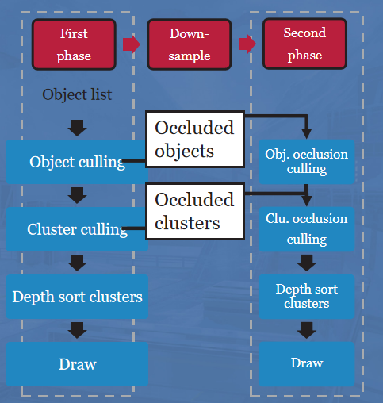
+ 根据上一帧的遮挡深度锥体（depth pyramid）进行遮挡剔除，将没有被剔除的物体绘制出来
    + 这里的遮挡剔除分为两步
        + 粗粒度的视口剔除（viewport culling）和遮挡剔除，也就是以 object 为剔除粒度
        + 细粒度的视口剔除、背面剔除（猜测应该跟ACU的三角形背面剔除一致）和遮挡剔除，剔除粒度为 Cluster
    + 将没有被剔除的物体绘制出来，因为是基于上一帧的遮挡深度，所以很多时候会有错误，分两种情况
        + 剔除了不该剔除的 object & Cluster，这会在接下来的步骤重新处理
        + 该剔除的没有剔除，两帧之间的差异不大，这样的该剔除而没有剔除的物体直接忽略，让它绘制出来（保守剔除策略的体现之一，该剔除而没有剔除的，直接不做处理）
+ 根据这一帧的数据（G-Buffer Depth Data）更新遮挡深度锥体
+ 根据更新后的遮挡深度锥体对被剔除掉物体重新做遮挡剔除，将没有被剔除的物体绘制出来
    + 这里的遮挡剔除对象是第一步过程中，通过了视口剔除和背面剔除没有通过遮挡剔除的物体
        + 没通过背面剔除的物体，在这里也不会通过背面剔除，所以被去掉了，但是视口剔除也不用管吗（如果快速移动镜头，这里会有问题吧？）

### 个人理解
当前的 GPU剔除，如果用本帧的数据就会有很大的剔除压力，非常耗时；但使用上一帧的遮挡深度，难以避免的情况就是剔除错误（快速晃动镜头导致两帧差异过大，如果物体恰好是由小物体拼成的，就容易出问题）。只有一些辅助手段去缓解或规避这样的情况，一个是给场景做一个背景包围盒（场景色调相似，给背景上一个差不多的颜色，就算剔错了，把背景盒画出来也不算很容易露馅）；二是近处物体不做剔除（优先把近处视野内的物体给保住，远处的物体剔除错误也不容易发现）。
然而现在把 GPU剔除的的数据处理放到了 GPU侧，让我们非常从容的在 GPU处理后的数据基础上可以做进一步处理。
我们可以使用当前帧的实时遮挡深度了，尽管也需要对当前帧的遮挡剔除做优化，ACU 的优化是只选取部分物体做遮挡深度图（基于距离），RedLynx的优化是只对被上一帧数据剔除掉的小部分物体做遮挡剔除。

## Shadow Occlusion Depth Generation
#### Camera Depth Reprojection

## 总结
*研讨会总结*
### GPU Driven Pipeline总结
### 个人感受