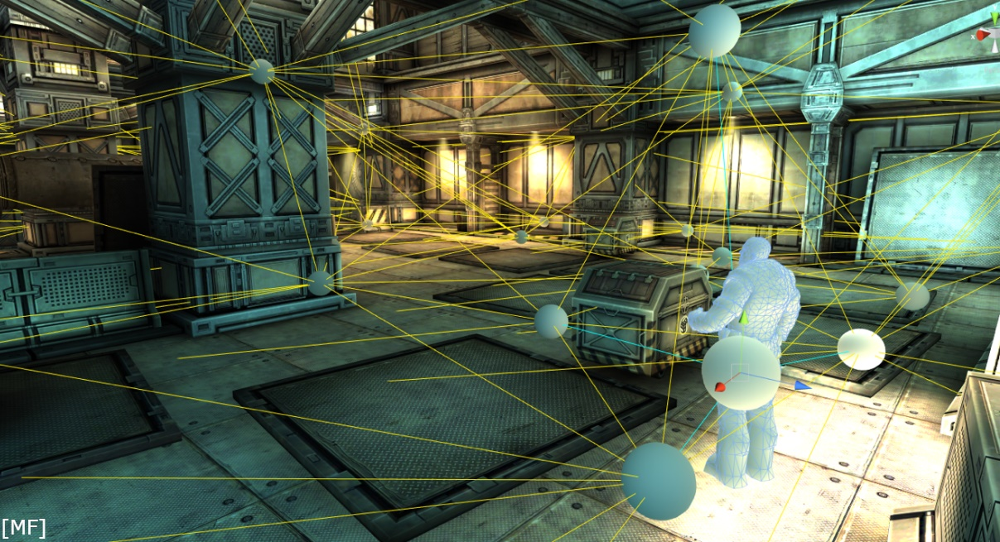
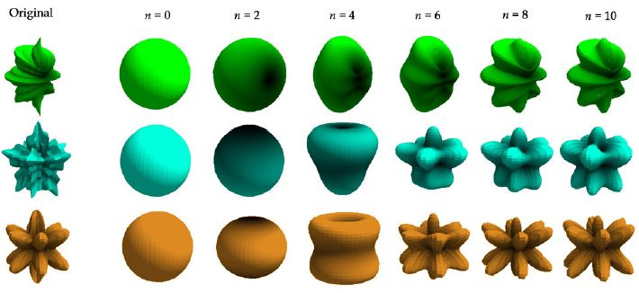
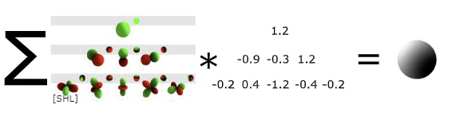
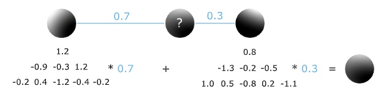
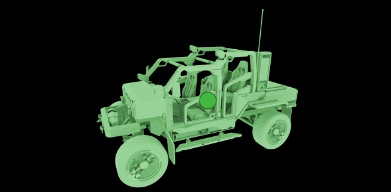
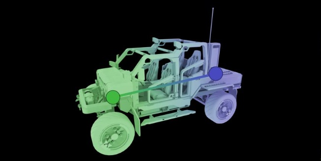
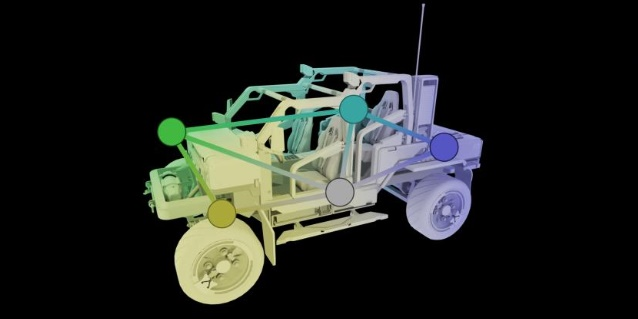
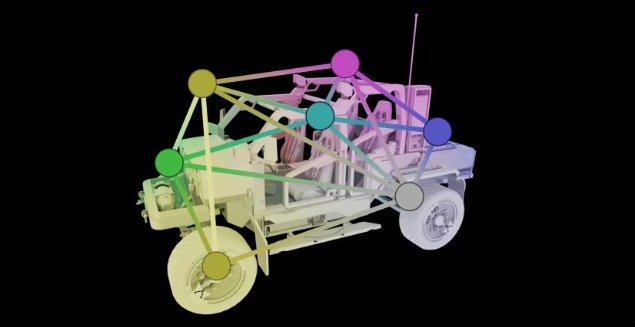
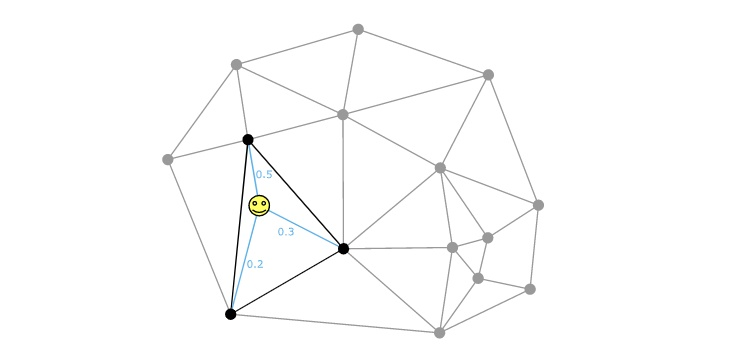
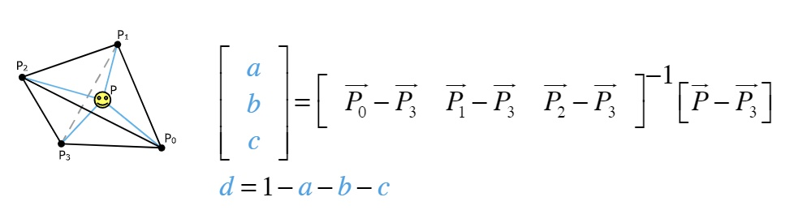

# LightProbe
If you can not render Mathematical formula, please read this [image_LightProbe_md_to_png](./LightProbe_md_to_png.png)

## 目录
+ [通用](#通用)
    + [作用](#作用)
    + [原理](#原理)
    + [实现方案](#实现方案)
+ [细节](#细节)
    + [Visibility](#visibility)
    + [Interpolation](#interpolation)
    + [Light Grid](#light-grid)
        + [探针分布](#探针分布)
        + [探针优先级](#探针优先级)

## 通用
光照探针存储烘焙过程中生成的间接光信息，做为补充光源为场景的的对象提供光照效果，减小游戏运行时处理光照的压力。

### 作用
光照探针主要有两个用途：
+ 为场景中的动态对象提供提前生成的间接光：
    + 实时光照在烘焙时生成间接光，运行时直接使用生成的间接光，减少实时光照的使用，从而节省运行时的光照计算开销
    + 弥补光照贴图不能应用于动态对象的缺陷
+ 为场景中结构复杂的静态对象提供提前生成的间接光：
    + 让复杂结构的静态物体不参与光照贴图的生成，弥补这个复杂物体在烘焙生成光照贴图时，对生成图面积的浪费

### 原理
光照探针原理分为三个部分：
+ 预计算生成光照探针数据
+ 运行时检测物体附件的光照探针，按照一定策略选取几个光照探针，并且做插值得到物体所在位置的光照模拟数据
+ 着色阶段通过模拟数据还原出光照信息，对物体进行着色

我们一个一个来看：
##### PartⅠ
烘焙过程中，在光照探针的周围进行光照采样，并使用球谐函数对采样结果进行模拟（一般以三维球谐函数来模拟），将得到的球谐函数系数存储到光照探针的数据中。这个过程就是预计算生成光照探针数据。
*至于如何采样、如何用球谐函数进行模拟以及为什么要使用球谐函数等问题本文不会提及，可以看看烘焙和球谐函数的相关文章。*

##### PartⅡ
当游戏或者编辑器运行时，我们会根据物体的位置和周围的探针进行计算，选取其中一个或者多个探针进行接下来的数据提取。
>这里列举一种常见的选取策略：使用探针来生成四面体，然后检测物体处于位置处于哪个四面体之中，就使用这个四面体的四个探针数据来进行数据计算。
>这种策略有两个注意点：
>+ 探针如何生成四面体
>+ 物体太大，导致物体有多个四面体包围着，如果只取用位置点的四面体，结果就不是很理想
>
>如果相邻探针的数据差异巨大，而物体大于这些相邻探针，那么只选取一个位置点来选择探针，结果就是移动时颜色变化剧烈。
>   *这个问题可以通过物体增加一些虚拟探测点来进行四面体检测来进行优化*

我们得到了四面体四个顶点的数据，现在我们要考虑如何获取四面体内部我们的物体坐标点的光照探针数据。
>我们根据四面体的四个顶点数据，对四面体内任意位置进行插值：
>+ 我们首先要判断，这四个点是不是都适合拿来做插值
>   + 我们考虑这样一个场景，物体处于房间外，它所在的探针四面体的四个点，一部分在墙内，一部分在墙外，显然我们应当舍弃墙内的点，只取用墙外的点
>+ 当我们确定了用来做插值的点之后，我们就可以根据距离、角度等属性插值得到物体位置的光照数据

##### PartⅢ
我们在PartⅠ中存储的数据是模拟光照的球谐系数，但是在着色阶段我们需要的是光照信息而不是球谐的系数。所以我们会根据球谐系数反算出此时的光照数据，然后开始着色。

### 实现方案
现在探针基本都是按照原理一节中的流程中步骤进行实现，主要实现区别包括但不限于以下几点：
+ 探针的选取和插值策略
+ 探针的分布策略
+ 可见性设置

本节将会讨论球谐在光照探针数据的基本使用和探针数据的插值这两个方面，更多的实现内容将在[细节](#细节)章节中呈现出来。

##### 光照探针中的球谐基础
任何一个球面函数 $f(\theta,\varphi)$ 可以用正交归一化的球函数 $Y_l^m(\theta, \varphi)$ 进行展开，这种类似于傅里叶展开，被称为广义傅里叶展开
> $\LARGE{ f(\theta,\varphi) = \displaystyle\sum_{l=0}^\infty \displaystyle\sum_{m=-l}^l C_l^m Y_l^m(\theta,\varphi) }$

通俗的理解上面的展开：**目标函数可以通过广义傅里叶展开以球谐函数表示出来，即使用球谐函数模拟目标函数**
我们重点理解其中三个部分： $f(\theta,\varphi)$ 、 $C_l^m$ 和 $Y_l^m(\theta,\varphi)$
+ $f(\theta,\varphi)$
    我们的目标函数，一般是复杂且难以表示的函数，用来被模拟的对象
+ $C_l^m$
    就是通常意义上的球谐系数，我们可以只记录系数来表示模拟结果
+ $Y_l^m(\theta,\varphi)$
    正交基，用来模拟其他函数的基函数，通过调整系数来影响模拟的结果
    >$ Y_l^m(\theta,\varphi) = 
    >\begin{cases}
    >   \sqrt{2}K_l^m\cos(m\varphi)P_l^m(\cos\theta) &\text{if } m>0 \\
    >   \sqrt{2}K_l^m\sin(-m\varphi)P_l^{-m}(\cos\theta) &\text{if } m<0 \\
    >   K_l^0P_l^{-m}(\cos\theta) &\text{if } m=0
    >\end{cases} $
    >$P_l^m(x)$ 是 $l$ 次 $m$ 阶连带勒让德函数，具有递归关系，可由计算机实现计算
    >这里我们可以把正交基当做已知条件来看待

既然是广义傅里叶展开，那么我们看一下他的展开式子：
> $ \{Y_l^m(\theta,\varphi)\} = \{ Y_0^0, Y_1^-1, Y_1^0, Y_1^1,\cdot\cdot\cdot \} $
>给定展开次数 $n$，得到球谐函数组的个数为 $S = 1 + 3 + 5 + \cdot\cdot\cdot + 2n-1$
>广义傅里叶系数相当于这样一个排列：$C_0^0, C_1^-1, C_1^0, C_1^1,\cdot\cdot\cdot$

我们把它写得简略一点可以得到：$f(\theta,\varphi) \approx aY_0^0 + bY_1^-1 + cY_1^0 + dY_1^1 + \cdot\cdot\cdot$
看一下模拟效果：

现在让我们来认识一下探针数据形成的过程（烘焙计算的相关内容，这里简略说一下）：
+ 烘焙时我们使用蒙特卡洛采样（Monte Carlo Sampling）计算特定点的辐照度
+ 在球体上（或者光照贴图的半球）生成随机光线
+ 把光线方向上的辐照度投影到正交基上，得到球谐系数（生成系数的过程被称为投影）

至此，我们得到了一组球谐系数，用来表示辐照度函数。
现在我们就可以使用球谐系数和正交基来求辐照度函数的近似结果了：

在着色阶段，我们根据方向（点的法线）解算就可以得到该点的辐照度了。

##### 常见探针插值
探针数据是由球谐系数和正交基线性组合而成的（球谐系数在空间中是线性分布的），对探针进行插值可以被表示为对球谐系数进行插值：

这就导致一个问题，因为线性关系，探针数据所表示的间接光被认为是线性变化的光，那么用探针来模拟非线性衰弱的直接光（尤其是点光源这种），效果非常差

交代过基础背景之后，让我们来看一下简单的插值策略：
+ Single Probe
    直接使用这个探针，不插值
    
+ 1D Interpolation
    两个探针形成一个线段，按距离做线性插值
    
+ 2D Interpolation
    三个探针为一组，三角形就按照重心坐标插值
    
+ 3D Interpolation
    4个探针组合为四面体，也按照重心坐标插值
    

三角形和四面体的重心坐标插值如下（简单过一下，单独的插值章节再展开）：
+ 三角形重心坐标插值
    
+ 四面体重心坐标插值
    

## 细节
### Visibility
### Interpolation
### Light Grid
#### 探针分布
#### 探针优先级