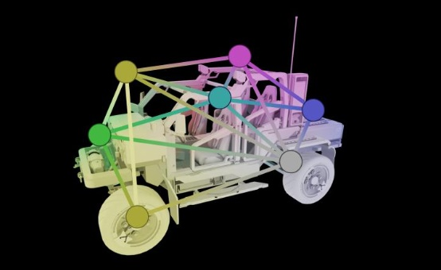

# LightProbe

## 目录
+ [通用](#通用)
    + [作用](#作用)
    + [原理](#原理)
    + [实现方案](#实现方案)
+ [细节](#细节)
    + [Visibility](#visibility)
    + [Interpolation](#interpolation)
    + [Light Grid](#light-grid)
        + [分布探针](#分布探针)
        + [探针优先级](#探针优先级)

## 通用
光照探针存储烘焙过程中生成的间接光信息，做为补充光源为场景的的对象提供光照效果，减小游戏运行时处理光照的压力。

### 作用
光照探针主要有两个用途：
+ 为场景中的动态对象提供提前生成的间接光：
    + 由实时光照生成间接光，减少实时光照的使用，从而节省开销
    + 弥补光照贴图不能应用于动态对象的缺陷
+ 为场景中结构复杂的静态对象提供提前生成的间接光：
    + 让复杂结构的静态物体不参与光照贴图的生成，弥补这个复杂物体在烘焙生成光照贴图时，对生成图面积的浪费

### 原理
光照探针原理分为三个部分：
+ 预计算生成光照探针数据
+ 运行时检测物体附件的光照探针，按照一定策略选取几个光照探针，并且做插值得到物体所在位置的光照模拟数据
+ 着色阶段通过模拟数据还原出光照信息，对物体进行着色

我们一个一个来看：
##### PartⅠ
烘焙过程中，在光照探针的周围进行光照采样，并使用球协函数对采样结果进行模拟（一般以三维球协函数来模拟），将得到的球协函数系数存储到光照探针的数据中。这个过程就是预计算生成光照探针数据。
*至于如何采样、如何用球协函数进行模拟以及为什么要使用球协函数等问题本文不会提及，可以看看烘焙和球协函数的相关文章。*

##### PartⅡ
当游戏或者编辑器运行时，我们会根据物体的位置和周围的探针进行计算，选取其中一个或者多个探针进行接下来的数据提取。
>这里列举一种常见的选取策略：使用探针来生成四面体，然后检测物体处于位置处于哪个四面体之中，就使用这个四面体的四个探针数据来进行数据计算。
>这种策略有两个注意点：
>+ 探针如何生成四面体
>+ 物体太大，导致物体有多个四面体包围着，如果只取用位置点的四面体，结果就不是很理想
>
>如果相邻探针的数据差异巨大，而物体大于这些相邻探针，那么只选取一个位置点来选择探针，结果就是移动时颜色变化剧烈。
>   *这个问题可以通过物体增加一些虚拟探测点来进行四面体检测来进行优化*

我们得到了四面体四个顶点的数据，现在我们要考虑如何获取四面体内部我们的物体坐标点的光照探针数据。
>我们根据四面体的四个顶点数据，对四面体内任意位置进行插值：
>+ 我们首先要判断，这四个点是不是都适合拿来做插值
>   + 我们考虑这样一个场景，物体处于房间外，它所在的探针四面体的四个点，一部分在墙内，一部分在墙外，显然我们应当舍弃墙内的点，只取用墙外的点
>+ 当我们确定了用来做插值的点之后，我们就可以根据距离、角度等属性插值得到物体位置的光照数据

##### PartⅢ
我们在PartⅠ中存储的数据是模拟光照的球协系数，但是在着色阶段我们需要的是光照信息而不是球协的系数。所以我们会根据球协系数反算出此时的光照数据，然后开始着色。

### 实现方案
现在探针基本都是按照原理一节中的流程中步骤进行实现，主要实现区别包括但不限于以下几点：
+ 探针的选取和插值策略
+ 探针的分布策略
+ 可见性设置

本节讨论球协在光照探针数据的使用和探针数据插值的两个方面。

##### 光照探针中的球协基础

##### 常见探针插值