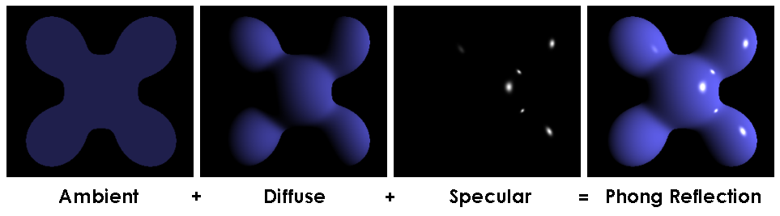

# Lighting Model

## 目录
+ [光照模型发展历史](#光照模型发展历史)
+ [经典光照模型](#经典光照模型)
    + [Lambert模型](#lambert模型)
    + [Blinn-Phong模型](#blinn-phong模型)
    + [Gourand模型](#gourand模型)

## 光照模型发展历史
我们回顾一下光照模型研究的发展历史

+ 第一次光照效果
    >1967年，Wylie等人第一次在显示物体时加入了光照效果。Wylie认为，物体表面上一点的光强，与该点到光源的距离成反比。
+ Lambert漫反射模型
    >1970年，Bouknight提出了第一个光照模型。该模型认为，物体表面朝向是确定物体表面上任意一点光强的主要因素，用Lambert漫反射定律计算物体表面上任意一点的光强，对于光照不能直射的地方，使用环境光做处理。
+ Gourand模型
    >1971年，Gourand提出基于“漫反射模型与插值”思想的Gourand模型。这是一种将漫反射模型应用到Gourand提出的Gourand着色频率的模型，计算物体每个顶点的光强，再根据顶点的颜色去插每个像素。

    

+ Phong光照模型
    >1975年，Phong提出了最具影响的简单光照模型。虽然是一个经验模型，但它已经将着色的真实度提高到了可以被接受的程度。Phong模型将光照分为镜面反射高光、漫反射光和环境光三种类型，把物体的高光、颜色、明暗等信息基本的表达了出来。

    

+ Blinn-Phong光照模型
    >1977年，Blinn对Phong模型的计算进行了优化，迭代出来了我们最熟悉的Blinn-Phong光照模型。该模型主要是对Phong模型的镜面反射高光计算进行了优化，引入半程向量，将高光的公式从反射方向与观察方向的点积简化到了法线与半程向量的点积。简化计算过程的同时，将计算角度约束到了90度以内，解决了原模型部分角度的高光缺失。

    

+ Whitted光线追踪模型
    >1980年，Whitted提出了光透射模型，Whitted模型，并第一次给出了光线追踪算法的范例。该模型综合考虑了光的反射、折射、透射、阴影等因素，但它仍然是一种经验模型。Whitted模型仅考虑了特定方向上的环境入射光对被照射点的光亮度共线的情况，因此它仅能模拟理想的镜面反射和规则的投射效果。

    

+ Cook-Torrance模型
    >1982年，Cook和Torrance克服了Phong模型的缺点，提出了一个基于物理光学的表面反射模型——Cook-Torrance模型。这个光照模型使得模型对象中反射光的位置和分布于实际情况非常接近，让绘制的图形具有很好的质感。
+ Hall光透射模型
    >1983年，Hall和Greenbert在Whitted模型的基础上进一步给出了Hall光透射模型，考虑了漫透射和规则透射光。该模型改进了Whitted模型中的投射高光效果，并给环境光加入了距离衰减因子，使整个模型能够更好的模拟物体表面的投射特性。
+ Kajiya渲染方程
    >1986年，Kajiya统一了以前所有的光照模型，提出了Kajiya渲染方程。Kajiya首先提出了使用类似于随机采样的蒙特卡洛方法求解绘制方程的光线追踪算法，通过对到达图像平面上的光线路劲进行采样，然后估计它们对最终图像的贡献来生成图像。

    

    $\LARGE L_o(x, \omega_o, \lambda, t) = L_e(x, \omega_o, \lambda, t) + \displaystyle\int_of_r(x, \omega_i, \omega_o, \lambda, t)L_i(x, \omega_i, \lambda, t)(\omega_i \cdot \mathbf{n})dw_i$

## 经典光照模型
介绍几种比较经典的光照模型
### Lambert模型
Lambert模型，又被叫做Lambert漫反射光照，认为物体表面的光强与入射光线的角度有关。

Lambertian reflectance定义了物体单位面积内接收到的光的强度和光入射方向反方向与法向的夹角负相关
$\LARGE L_d = k_dmax(0, \mathbf{n} \cdot \mathbf{l})$

Lambert's cosine law（Lambert余弦定理）：以不同角度接收到的相同强度的光，所获得的光线数量（光能）不一样，
+ 假设光是离散的，在垂直入射到shading point的数量是6
+ 光照不变，仅仅是将shadingpoint旋转60度，此时入射光线只有3，接收到的光减少了，物体表面就会暗一些
+ 我们推广可得，物体接收到的光的大小和光线方向与法向的夹角负相关，和 $\cos\theta = n \cdot l$ 正相关

### Blinn Phong模型
Phong和Blinn-Phong模型区别不大，我这里将他们合起来将

#### 光线类型
以下图为例，Phong模型将光线分为不同类型：

+ Specular highlights，镜面反射高光（也被称为镜面光），可以观察图中比较亮的高光部分，这里接收到的光线经过镜面反射，将光线射入摄像机，这种光被称为镜面光
+ Diffuse reflection，漫反射光，物体除高光外，整体表现出一个变化不明显的颜色，这是光线在物体表面发生漫反射，只有一定类型的光辉射入摄像机，这些光线被叫做漫反射光
+ Ambient lighting，环境光，图中杯子的最左侧，可以看到没有光照直射，但是仍然可以看见光，因为这是光线多次反射折射所形成的光，它的来源很复杂，我们把它简化为一种光，叫环境光，一般是被设置为常量

#### 漫反射光
光线打到物体的表面会被均匀的散射到各个方向，从所有观察方向上都会看到同一种颜色，这就是物体的颜色

但是漫反射实际接收到的光要受到两个条件的约束——入射角度和光源距离
+ **光线的入射角度影响物体接收到光的大小，可以使用 $\cos\theta = \mathbf{n} \cdot \mathbf{l}$ 来表示**
    Lambert模型中提到的Lambert's cosine law
+ **光源的距离影响物体接收到光的大小，可以使用 $I/r^2$ 来表示**
    光的能量会随距离增加而衰减：距离越远，单位面积内接收到的光能越小
    + 假设点光源向外辐射的光能是离散的，下图是不同时刻光能在不同位置的可视化
    + 由能量守恒假设光能不会衰减，那么每个时刻的光能总量不变，即每个光圈代表的能量相同
    + 那么随着距离的增加，光圈面积变大，那么单位面积内接收到的光能就减小了
    + 光能大小和球体面积的增加成反比，即 $I/r^2$

    
    
给出漫反射的着色公式：

$\LARGE L_d = k_d(I/r^2)max(0, \mathbf{n} \cdot \mathbf{l})$
+ $L_d$，与观察方向没有关系，因为漫反射是均匀的向各个方向上散射，所有方向光都一样
+ $k_d$，漫反射系数，表示这个点的吸收率（明暗）；如果用一个RGB值来表示这个系数，就可以表示这个shading point的颜色
+ $I/r^2$，光强随距离的增加而衰减
+ $max((0, \mathbf{n} \cdot \mathbf{l})$，这里约束为非负数，因为 $\mathbf{n} \cdot \mathbf{l}$ 的结果为负表示光从下方射过来，这样对这个着色点完全没有贡献（不考虑折射）

这里就展示了，光照不变的情况下，漫反射系数越大那么物体就越亮

#### 镜面反射光
在光线镜面反射的出射方向附近看向shading point，会发现shading point更加明亮，也就是说镜面反射方向 ${R}$ 与观察方向 ${v}$ 的夹角越小，镜面反射光越大

在 Blinn-Phong光照模型中，镜面反射方向和观察方向的关系转换为了半程向量与法向的关系
+ 半程向量与法向越接近，表示镜面反射方向与观察方向越接近

+ 镜面反射方向比较难求，但是半程向量非常好计算
+ 半程向量公式：$h = bisector(\mathbf{v}, \mathbf{l}) = \frac {\mathbf{v + l}} {||\mathbf{v + l}||}$

给出镜面反射的着色公式：
$$\LARGE\begin{split}
L_s &= k_s(I/r^2){max(0, \cos\alpha)}^p \\
    &= k_s(I/r^2){max(0, \mathbf{n \cdot h})}^p
\end{split}$$
+ $L_s$，镜面反射光
+ $k_s$，镜面反射系数；如果用一个RGB值来表示这个系数，就可以表示这个shading point高光的颜色
+ ${max(0, \mathbf{n \cdot h})}^p$ ，光使用夹角来表示高光的变化太过于平滑，真正的高光是只有一小段夹角才能观察到，因此给夹角关系增加一个指数级的系数，来凸显高光跟角度的剧烈变化关系

    

    只要角度轻微变化，那么这个项的值就会快速衰减，这正符合我们对镜面高光的期望

这里就展示了，光照不变的情况下，漫反射系数越大那么物体高光就越亮；$p$值越大，高光区域就越小

#### 环境光
光线经过环境中所有物体的多次反射与折射，最终照射到shading point，这一部分光太过于复杂，被Blinn-Phong模型近似成了一个固定值，不受任何参数的影响
给出环境光的着色公式：

 $\LARGE L_a = k_aI_a$
+ $L_a$，环境光反射
+ $k_a$，环境光系数；如果用一个RGB值来表示这个系数，就可以表示这个shading point环境光的颜色

#### Blinn-Phong Reflection Model
我们用上面提到的三种光照将Blinn-Phong光照明模型给组合起来：
$$\LARGE\begin{split}
L &= L_a + L_d + L_s \\
    &= k_aI_a + k_d(I/r^2)max(0, \mathbf{n} \cdot \mathbf{l}) + k_s(I/r^2){max(0, \mathbf{n \cdot h})}^p
\end{split}$$
作用于模型的结果如下：

+ 环境光，给模型所有位置均匀的光照
+ 漫反射光，光线照射到模型的方向与模型法线，夹角越小的地方，光照越强
+ 镜面反射光，观察方向和光线的镜面反射方向接近的地方，模型会产生高光

#### Phong模型和Blinn Phong模型的差异
Blinn-Phong模型主要是优化了Phong模型对镜面反射高光的计算，我们来对比一下两者的计算差别
+ Phong模型
    + $\mathbf{r} = reflect(-\mathbf{l}, \mathbf{n})$
    + $L_s = k_s(I/r^2){max(0, \mathbf{v \cdot r})}^p$
+ Blinn-Phong模型
    + $\mathbf{h} = bisector(\mathbf{v}, \mathbf{l})$
    + $L_s = k_s(I/r^2){max(0, \mathbf{n \cdot h})}^p$

Blinn-Phong模型引入了半程向量，将观察方向和光线反射向量的计算关系转换为了半程向量和法向的计算关系，有两个优点：
+ 简化计算量，计算半程向量比计算光线的反射向量更简单，计算量更少
+ 半程向量与法向的夹角永远不大于90度，这解决了Phong模型在反射向量与视线的夹角超过90度时无法计算出高光的问题

### Gourand模型
Gourand在1971年提出了一种着色频率，Gourand Shading。Gourand没有对光照模型做什么改进，只是将其他光照模型和自己提出的着色频率结合起来绘制图形。

以模型的顶点为单位，计算每个顶点的光照，然后使用顶点颜色给三角形内的像素插值
    

+ 三角形各个点的颜色由顶点插值得到
+ 这个点所在的几个面的法线做平均来求取顶点的法线
+ 这个着色对高光描述得不是很好

这里我们将另一种特别的着色频率结合Blinn-Phong光照模型结合起来看一下效果

面着色(Flat shading)，以模型的三角面为最小单位，计算光照，给面的所有像素设置相同的颜色

