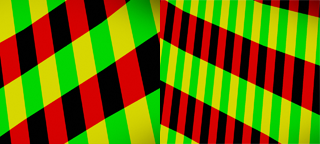

# Rain

## 目录
+ [方案对比](#方案对比)
    + [雨粒子特效](#雨粒子特效)
    + [雨纹理UV动画](#雨纹理UV动画)
    + [方案选择](#方案选择)
+ [雨丝渲染](#雨丝渲染)
    + [梭体](#梭体)
    + [雨纹理](#雨纹理)
    + [风的影响](#风的影响)
    + [雨的层次效果](#雨的层次效果)
    + [雨的深度遮挡](#雨的深度遮挡)
    + [雨的高度遮挡](#雨的高度遮挡)
+ [地表雨效果](#地表雨效果)
    + [潮湿](#潮湿)
    + [积水](#积水)
    + [涟漪](#涟漪)
    + [水珠](#水珠)

## 方案对比
雨渲染从整体实现上，大致可以分为两种：
+ 雨粒子特效
+ 雨纹理UV动画

### 雨粒子特效
先看一下雨粒子特效的效果，这是 [NVIDIA Direct3D SDK 10 Code Samples](https://developer.download.nvidia.cn/SDK/10.5/direct3d/samples.html#rain) 里雨的例子，使用粒子系统实现了简单的 [雨场景（视频例子）](./images/Rain.wmv)

+ 大雨
    + 场景使用 3,000,000 个雨粒子来模拟大雨

    

+ 小雨
    + 场景使用 6,000 个雨粒子来模拟小雨
    + 尽管有 6,000 个粒子，其实这个时候的效果已经不是很好了
    + 如果要有朦胧细雨的那种密度，粒子数量需要提升至少一个量级

    

+ 雨叠加风向
    + 雨叠加风的影响，模拟风雨交加的情况
    + 粒子叠加风向还是比较容易的，比较好实现，不过计算量嘛（每个粒子都需要计算一次风向叠加？）

    

+ 雨花
    + 雨落到地面，溅起水花
    + 粒子碰撞的效果，看起来还是很好的

    

+ 雨叠加点光
    + 雨和光线的叠加
    + 很容易给每滴雨计算各自的光照，不过还是计算量的问题

    

优点：
+ 实现起来简单直接
    + 使用现成的粒子系统和粒子碰撞
+ 效果好
    + 大雨小雨模拟都很真实
    + 雨水落下和地面互动的效果很真实
    + 容易计算不同光照的影响

缺点：
+ 使用粒子系统，消耗巨大
    + 小雨情况下，仍然使用了 6000 个粒子来模拟，但小雨的雨点看上去过于稀疏，效果不好
    + 风向计算、光照计算、地面的粒子碰撞计算，整体计算量都会随着粒子的增加而增加
    + 粒子系统本身就算是一个比较耗的模块，上万的粒子数量就已经受不了了

总结起来就一句话：它很好，是我电脑不够好

### 雨纹理UV动画
看一下这种方案的雨渲染的经典例子——[AMD ATI Toyshop video demo](https://www.youtube.com/watch?v=LtxvpS5AYHQ)


核心思路就是给屏幕挂一个全屏贴图，将雨丝的贴图滚动播放，以此来模拟雨滴滑落的效果。这种方案是基于后处理的思路而来的，我们在最后的阶段直接画上雨丝，不再考虑雨和其他物体碰撞关系。


优点：
+ 消耗低，计算量小
    + 仅仅用个面片，把雨丝的纹理画上去，然后计算UV偏移
+ 效果不错，就视频中的效果来说，看上去比较真实不错

缺点：
+ 雨纹理UV动画仅仅表现了雨滴滑落的效果，地面的水花，涟漪等碰撞效果需要单独处理
+ 必须固定镜头，让视角不要仰视或者俯视，不然会看到雨从奇怪的地方落下或者雨水平行于天空或者地面
    + Rain Texture 平行于镜头，会在俯仰角发现雨和天空、大地等平行

    
    ~~【TODO：搭个例子，调一些对比图出来吧】~~

    + Rain Texture 不平行于镜头，仰视天空会出现雨从四周向中间汇聚的现象，俯视大地会出现雨从中间往四周发散的现象

    
    ~~【TODO：搭个例子，调一些对比图出来吧】~~

+ 不好让雨丝叠加方向风
    + 最直观的场景就是，镜头朝着风的反方向看去，正确的情况下是雨往两边发散，仅适用面片无法模拟这个情况
    
    
    ~~【TODO：搭个例子，调一些对比图出来吧】~~

+ 遮挡处理比较困难
    + 深度遮挡，我们往雨幕中看起，显然没有前景遮挡的地方雨丝多一些，有近景遮挡的地方雨丝少一些
    ~~【TODO：图片或者作图演示】~~
    + 高度遮挡，比如我们在屋内这种头顶有遮雨物的场景下，雨丝被房间等物体遮住，在窗口门口等地方就应该能看到雨丝
    ~~【TODO：图片或者作图演示】~~

### 方案选择
尽管雨纹理UV动画有这样那样的缺点，尽管雨粒子模拟有非常好的效果，但是我们更需要的是，性能！性能！还TM是性能！！！

最终选择了雨纹理UV动画来实现雨渲染，原因如下：
+ 雨去牺牲性能太不划算，收益和性能消耗比太低
+ 雨的缺点可以使用一些这样那样的方法解决

既然选择了雨纹理UV动画方案实现雨渲染，那么我们势必要把工作分为两个部分
+ 雨丝渲染
+ 地表雨效果

接下来也会按照这两个课题来研究如何实现效果不错，没有明显瑕疵，可以被接受的雨渲染效果

## 雨丝渲染
本节主要记录雨丝渲染的实现细节，包括实现过程中的一些注意点和这个方案的自带问题的解决方法

### 梭体
首先是雨纹理贴图的载体，我们将纹理的载体从面片切换到了梭体
~~【TODO：图片或者作图演示】~~
梭体的结构为正反两个圆锥，一上一下组合在一起

#### 核心思路
我们把纹理贴图的载体从二维升级到了三维，自然不能再让其固定到镜头前面，现在我们将镜头放到梭体内部正中心，这样我们每次都会看到梭体的内部
~~【TODO：图片或者作图演示】~~

我们这么做，最主要的目的就是解决镜头俯视和仰视的问题。我们前面提到过，不管面片是垂直于地表固定角度，还是平行贴合镜头的 up 方向，都会在旋转镜头俯仰角时，造成雨丝的不自然显示（聚拢、分散、平行于天空跟地面等）。现在，将镜头放置于梭体内部的正中心，即设置梭体的位置一直与镜头同步，然后我们将纹理铺到梭体的内表面上，这样雨纹理就呈现到了镜头前。

那么，梭体是如何解决镜头俯仰视角的问题呢？镜头如果平视前方，会看到梭体的斜面，这不会影响雨纹理的呈现么？

#### 原理
我们现在来解决这几个疑惑点，我们分别从镜头平视、仰视和俯视三个角度来观察梭体，分析梭体对最终画面的影响

##### 平视梭体
我们以横切面的视角来观察相机和梭体：
+ 梭体的横截面


+ 相机观察梭体的结果


可以看到，最终相机观察到的梭体的的线框是由倾斜的，那么雨纹理覆盖到上面也是倾斜的，也就是说梭体的斜面是会影响雨纹理的呈现

如果解决？
+ 拉长梭体，减小梭体斜面的倾斜程度

    

+ 在上下两个圆锥的中间加一个圆柱体，这样平视就会得到正确的画面（《Remember Me》使用这个 Mesh 作为雨纹理的载体）
    

+ 不做处理，除非梭体太扁平了，否则在实际下雨过程中，看不出别特的瑕疵（我就没有做处理，只能说——开摆）

##### 仰视梭体
梭体的位置与相机相对固定，不会随着相机旋转、倾斜而有所变化，画出相机与梭体的仰视图：


从相机视角来看梭体的内部仰视图，我们只会看到从中间到屏幕四周发散，这就比较符合我们在雨天抬头仰望雨丝落下的情景，有种雨丝从空中飘落下载屏幕上的感觉

上一张效果图看一下：
~~【TODO：图片或者作图演示】~~

我们的确解决了相机仰视的视角问题，但是这个从中心到四周发散的效果并不好。先分析一下原因，真实的雨水，是在高空凝聚水雾形成雨滴，然后落下。那么图中的中心点就可以理解成是雨滴形成的地方，这个地方离我们非常远。这个图实际包含了从雨滴形成的高空到相机位置区域内的所有雨丝，这么深的距离，雨丝的颜色都一样，看着就比较出戏。真实的效果应该是从远到近，雨丝逐渐变得明显才对。

现在，分析出了仰视视角得到的实际效果不好的原因，就可以着手进行优化了：
+ 去掉上下的线条汇集点，修改梭体，将上下的圆锥改成没有上底的圆台，雨水不再汇聚到中间点，这样可以很大程度的减缓仰视的效果问题


+ 手动调整透明度，给出两种不同的调低透明度的思路（实测效果都不错）
    + 仰视时调整雨丝透明度，随着仰视角度增加，减小雨丝的透明度
    + 根据梭体的高度，给不同高度的雨丝设置不同的透明度

上述方法改进之后，仰视下雨图就没有什么瑕疵了
~~【TODO：图片或者作图演示】~~

##### 俯视梭体
相机与梭体的俯视图，跟仰视图一样，都是从中间到四周发散：


同样的在仰视存在的效果问题，在俯视一样的存在，如果要解决，和仰视的方案一致即可

但是，俯视和仰视有一个本质的差别 —— 俯视往往是看到脚下的地面。在后面雨的深度遮挡一节，我们会利用遮挡巧妙的解决仰视和俯视的瑕疵问题。因为俯视时，地面离我们很近，就把雨给遮挡住了。

### 雨纹理
本节介绍如何处理纹理

#### 定义
制作一张雨丝的纹理，大致像这样：


对纹理做了如下定义：
+ 纹理只用来做雨的不透明度计算，不使用纹理的颜色值作为实际颜色值
+ 纹理图片的不同通道的含义：
    + R 通道：保留
    + G 通道：不透明度
    + B 通道：深度
    + A 通道：保留

#### 使用
使用简单的 UV 动画让雨纹理动起来，模拟雨丝从上方滑落的场景：
```hlsl
float2 uvSpeed = float2(hSpeed, vSpeed);
float2 uv = fUV - uvSpeed * deltaTime;
```
给梭体的 UV 坐标加上一个偏移，纹理就动了起来
+ `hSpeed` 、 `vSpeed` 分别表示水平和竖直移动的速度，结合deltaTime就可以控制纹理运动的快慢
+ `hSpeed` ：控制雨的横向移动（横向移动有什么用？跟雨的层次效果有关）
+ `vSpeed` ：控制雨的纵向移动，也就是控制雨的下落速度（雨越大，下落速度越快）

雨的大小程度，除了跟雨的下落速度有关外，还和雨的稀疏稠密程度有关。因此对 UV 操作来模拟雨的稀疏和稠密程度：
```hlsl
float2 uvSize = float2(hSize, vSize);
float2 uv = fUV * uvSize;
```
+ `hSize` 、 `vSize` 分别表示水平和竖直的纹理放大倍数
+ 例如 `float2(1.0, 1.0)` 相机显示的雨的初始大小，改到 `uvSize = float2(10.0, 20.0)` 之后相机显示雨的宽高都缩小了，雨就变得很密集

### 风的影响
在现实生活中，雨不是完全垂直下落的，它往往是顺着风向，倾斜滑落
~~【TODO：图片或者作图演示】~~

那么如何控制雨的倾斜方向？
一个简单直接的做法就是，给雨加上水平位移，让雨往下竖直滑落的同时向左或右移动，这样雨就会倾斜的滑落
~~【TODO：图片或者作图演示】~~

看着效果有那么点感觉了。但我们旋转相加的偏航角（绕 y-axis 旋转），就会发现问题。雨的倾斜角度和相机的视角永远是固定，比如给雨设置向右的水平运动速度，那么不管我们如果旋转相机偏航角，我们看到的雨倾斜方向永远是向右的。这显然是不对的，雨丝的倾斜方向应该要跟随风向，永远朝着一个方向倾斜。

这里列出不同方向下，相机观察风和雨的正确表现：
+ 风迎面吹向我们，相机正对风的方向，即相机的 $lookat.xz$ 和 风的 $dir.xz$ 方向相反
~~【TODO：图片或者作图演示】~~
+ 风从背后吹向我们，相机背对风的方向，即相机的 $lookat.xz$ 和 风的 $dir.xz$ 方向相反
~~【TODO：图片或者作图演示】~~
+ 风从侧面吹向我们，相机垂直于风的方向，即相机的 $lookat.xz$ 和 风的 $dir.xz$ 方向垂直，这里又分了两种情况
    + 风从左侧吹过来，即 $lookat.xz \times dir.xz < 0$
    ~~【TODO：图片或者作图演示】~~
    + 风从右侧吹过来，即 $lookat.xz \times dir.xz > 0$
    ~~【TODO：图片或者作图演示】~~

如何实现上述效果，难道根据风向和相机朝向的相对角度，去设置雨的倾斜方向和倾斜程度？这个方法显然不可取，算风向和相机朝向的相对角度并不困难，但是根据相对角度去设置倾斜方向和倾斜程度就非常难了。就算我们勉强写出两者的对应关系，也难以保证得到结果的真实性以及相机连续转动时结果的平滑变化。

我的实现方法是，倾斜梭体，让梭体的中轴线和风向保持一致：


看上去很抽象，但是我们直接带入相机和风不同视角下雨的倾斜方向，就能得到上面列出的各个方向下雨的效果

我们来理一下这个方法的细节：
+ 设梭体的默认方向 $dir_{shuttle} = (0, 1, 0)$ ，风的方向 $dir_{wind} = (x, y, z)$
+ 先忽略风的 $y$ 轴，梭体应该逆着风向旋转，旋转后梭体的方向应该类似于这样 $dir_{shuttle} = (-dir_{wind}.x, Y, -dir_{wind}.z)$
~~【TODO：图片或者作图演示】~~
+ 这里我们有个 $Y$ 还没有确定，这个值表示了梭体的倾斜程度， $Y$ 值越大倾斜程度越小， $Y$ 值越小倾斜程度越大
~~【TODO：图片或者作图演示】~~
+ 梭体不可能无限向下倾斜，$Y$ 值一定会有一个最小值，不妨取倾斜45度为最大倾斜角
    + 首先对风的 xz 平面的方向做归一化：$nor_{windXZ} = normalize(-dir_{wind}.x, 0, -dir_{wind}.z)$
    + 以 $nor_{windXZ}$ 为基准写出梭体最大倾角时的方向：$dir_{shuttleMAX} = (nor_{windXZ}.x , \sqrt{(nor_{windXZ}.x)^2 + (nor_{windXZ}.z)^2}, nor_{windXZ}.z)$
    + 那么雨倾斜度从大到小，$Y$ 的取值范围自然能写出来 $Y \isin [\sqrt{(nor_{windXZ}.x)^2 + (nor_{windXZ}.z)^2}, +\infin]$

### 雨的层次效果
在现实生活中，下雨往往是在一个大范围内发生，我们既能看到近处的雨，也可能看到远处的雨。显然，只简单的使用 UV 动画来模拟下雨，并不能很好的表现出雨的空间感，所有雨丝都在一个平面内滑落，感受不到雨的纵深。本章节就来解决这个问题，如何表现出雨的远近，让雨下得有层次感。

#### 雨的深度
我们能感受出现实生活中雨的纵深感，一个很重要的原因就是雨的深度，即雨丝离我们的距离。距离近时，我们能看到非常明显的雨丝，距离远时，雨丝就不那么明显了。那么对应到图形学上来，距离我们越近，雨丝就越亮，不透明度就越高。
~~【TODO：图片或者作图演示 雨丝的远近对比】~~

还记得我们前面对纹理做的定义吗？我们使用纹理贴图的 G 通道作为雨丝的深度，给每一个雨丝都赋予了深度。但是我们并没有去使用这个定义，现在我们就把它用起来。

现在我们假设每一个雨丝的深度都是基于相机的深度，即距离相机距离。这我们简单的做一个乘法，将雨丝的深度应用到雨丝的绘制上去：
```hlsl
float3 color = (x, y, z); // rainBaseColor
float colorSize = 1.0; // 雨丝的明亮程度
float rainDepth = sample(texture, uv).g; // 取采样纹理得到结果的 g 通道作为雨丝深度
colorSize = colorSize * (1 - rainDepth); // 深度和 colorSize 成反比
color = color * colorSize;
```
上述过程直观的表示了雨丝离我们越近，看上去就会越明亮。

还有一种更加直接的方法，在制作纹理的时候直接给每个雨丝附一个明亮程度值，也就是我们前面提到的纹理贴图的 B 通道。给 G 通道设定深度值，再人为的控制每个深度值对应的雨丝明亮程度，写入 B 通道。使用时，我们读取 B 通道值去控制每个雨丝的明亮程度。（在实际使用中，直接使用 `1 - rainDepth` 效果并不好，手动设置 B 通道值，基于经验来写入明亮程度，效果更好）

#### 多层雨幕
雨丝的层次感，除了体现在雨丝越远，越不明亮外，还体现在尺寸上。这是一个很直观的近大远小的例子（鸽子为什么那么大.jpg），距离远的雨丝尺寸小于距离近的雨丝。从整体来看，近处的雨丝大而少，远处的雨丝多而小。假如我们将雨分为两层雨幕，近的雨幕雨丝大而少，远的雨幕雨丝小而多，将两层一叠加，层次感一下子就出来了。
~~【TODO：图片或者作图演示 雨丝的远近对比】~~

至于怎么将雨的近大远小表现出来，就要结合我们对纹理的使用来进处理了。基本的思路就是，给近处的雨幕设置较小的纹理放大倍数，给远处的雨幕设置较大的纹理放大倍数。


考虑如何叠加几层雨幕：
+ 有几层雨幕就绘制几次：
    从远到近的绘制不同的雨幕，用近处的雨幕覆盖远处的雨幕
+ 只绘制 1 次，不同雨幕预先进行不同纹理扩大倍数的采样，将近处雨幕和远处雨幕的颜色值加起来

前者是多个 Drawcall ，每个 Drawcall 单次采样；后者是单个 Drawcall ，多次采样。

在多层雨幕叠加是，还可以给每层雨幕加一个偏移，让层与层之间出现交错，来增加层次分明的感觉



### 雨的深度遮挡
我们现在来处理开头提到过的雨的深度遮挡问题。

~~【TODO：图片或者作图演示】~~

如果是使用粒子系统来实现雨效果的话，每个雨滴都是单独的模型对象，那么可以直接使用坐标进行深度测试，那些被遮挡的粒子直接剔除掉就行了；但我们使用纹理动画来模拟下雨，那么雨实际上都是在梭体的内表面上，他们有这固定的深度，同时梭体的位置一直和相机重合，处于相机视角的最前面，也就是说雨丝一直都处于其他物体的前面。如果依靠这样的深度关系，肯定不能得到令人满意的遮挡处理。

我们一开始定义纹理的时候，特意为纹理专门留出了深度通道，在[雨的层次效果](#雨的层次效果)的章节中，我们简单的直接将 G 通道的值作为雨的近和远的比例值，然后对不同距离比例的雨做了不同处理。现在，我们利用这个深度比例，为雨设置一个正在的深度值。

核心思路：
+ 设置雨的显示距离，表示雨只在该距离内才显示
    + 显示距离指雨丝和相机的垂直距离，这里用到了视锥体的近裁剪面和远裁剪面的想法
    + `nearDepth`：最近显示距离
    + `farDepth`：最远显示距离
+ 将雨的深度比例 $g$ 映射到 $[nearDepth, farDepth]$ 之间
+ 这样就可以的算出雨的深度 $rainDepth = mix(nearDepth, farDepth, g)$
+ 相机视角渲染出一张场景深度图
+ 雨的深度和场景深度做遮挡判断

我们可以看到，雨的深度遮挡判断流程中，我们必定会使用到相机视角的场景深度图，这一点没有办法避免。所幸的是，相机场景深度图在很多环节都会用到，我们不必考虑生成场景深度图的性能消耗。

### 雨的高度遮挡
接下来，我们来处理另一个方向的遮挡问题 —— 高度遮挡。最常见的场景就是，相机处于下雨天气的建筑内，我们并不应该在这个时候看到雨丝滑落。

~~【TODO：图片或者作图演示】~~

和深度遮挡问题相同，在纹理动画中模拟出来的雨丝，它的实际位置都是在梭体内表面的，我们并不能把这个位置当做每个雨丝的实际位置。


## 地表雨效果
