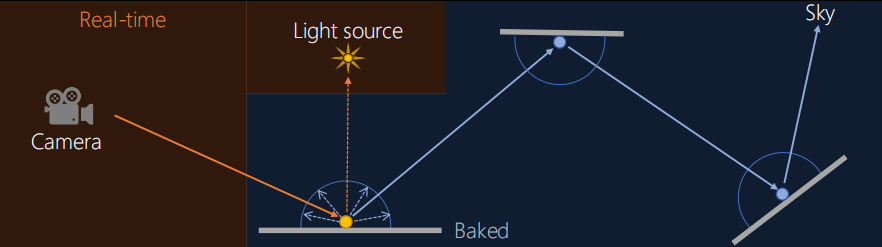

# SH in Baking
*球谐函数在烘焙中的应用，默认已经了解球谐的基础了，简略了解球谐基础请点击[光照探针中的球谐基础](../LightProbe/LightProbe.md)*

## 目录
+ 为什么选用 SH 表示
+ 球谐辐照度函数
    + 烘焙球谐函数
    + 简化
    + 编码
    + 近似镜面光

## 为什么选用 SH
### 路径追踪表示的 Global Illumination
先看一下全局光照（Global Illumination，后文简称 GI）在路径追踪里的表示：

我们在镜头里看见某一个位置 $x$ 的光照就像图中显示的一样，有许多来源，并且某些光源的路径比较复杂。
我们尝试表示图中这个路径的光线：$L_o(x, \omega_o) = L_e(x) + \int_{\Omega}{L_i(x, \omega_i)f_r(x, \omega_o, \omega_i)(\omega_i \cdot n)d\omega_i}$
有这样两个问题：
+ $\omega_o$ 是我们的相机位置向量，但是烘焙阶段我们并不知道具体的值
+ $n$ 是着色阶段的法向量，我们可能不知道（法线贴图和不同的 LOD 让我们不能确定法线的具体方向）

我们应该需要存储 GI数据，方便 runtime 计算得到。一个比较常见的方法就是用把 GI数据 烘焙成 辐射函数（radiance function）或者辐照度函数（irradiance function），然后使用球谐函数（spherical harmonic，后文简称 SH）模拟后，存储得到系数。
本文使用 1阶球谐函数（L1 SH）来存储辐照度数据（irradiance data）。

### 为什么使用 SH
寒霜的Flux Baker评估了不同的存储预计算 GI数据的方法，基于以下原因最终选择了 SH
+ 不需要切线的相关计算
    + RNM or H-Basis 需要
+ RGB 分离的方向光计算（direction lighting）
    + ambient + highlight direction(AHD) 做不到
+ 高对比度的漫反射光
+ 可以计算近似的镜面反射光
+ L1 SH 在存储占比、还原消耗和还原质量表现好

[Converting SH Radiance to Irradiance](https://grahamhazel.com/blog/2017/12/22/converting-sh-radiance-to-irradiance/)
[baking artifact free lightmaps](https://ndotl.wordpress.com/2018/08/29/baking-artifact-free-lightmaps/)
[pi or not to pi in game lighting equation](https://seblagarde.wordpress.com/2012/01/08/pi-or-not-to-pi-in-game-lighting-equation/)