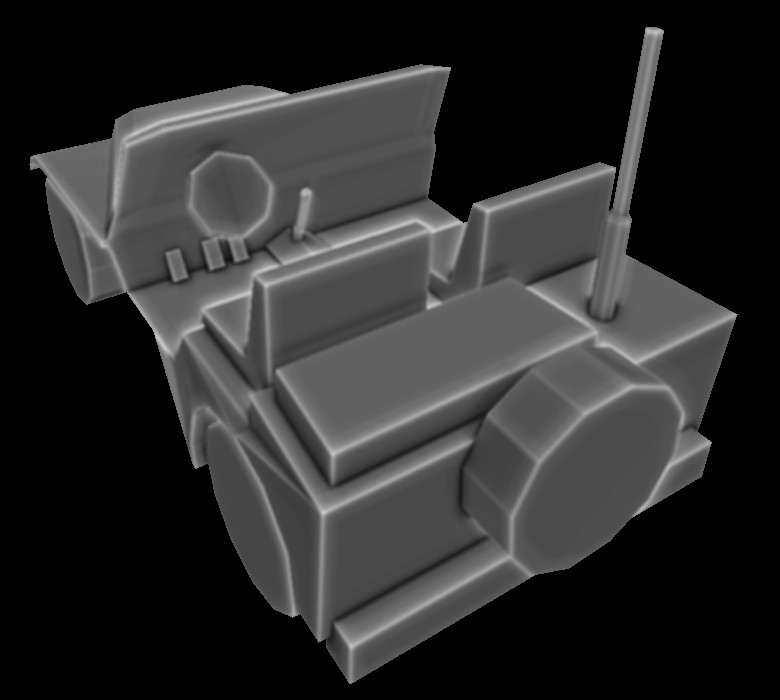
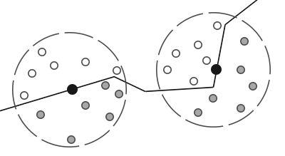
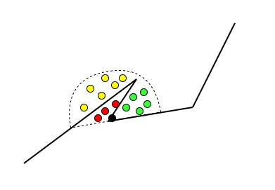

SSAO
*补一下 SSAO 相关的知识，最近处理这边的问题，没接触过不太了解*

## 目录
+ SSAO
    + AO
    + SSAO基本原理
+ 优化实现
    + HBAO
    + GTAO

## Screen Space Ambient Occlusion

>这里先列举几个资料，写完本篇后删除：
>[learnopengl-ssao](https://learnopengl-cn.github.io/05%20Advanced%20Lighting/09%20SSAO/)
>[SSAO doc](https://ogldev.org/www/tutorial45/tutorial45.html)
>[SSAO with Depth Reconstruction](https://ogldev.org/www/tutorial46/tutorial46.html)

### Ambient Occlusion
在常规的 Blinn-Phong 光照模型中，我们主要实现了漫反射光照和镜面反射光照，其他类型的光照（比如散射的光线、折射的光线、其他物体的反射的光线等等）由于建模和计算过于复杂，我们将它看做了固定大小和方向的环境光（Ambient Lighting）。

环境光主要用来模拟光的**散射（Scattering）**，这是一种模拟近似来减少计算量的思想，它在大多数场景效果都还不错，但是对于角落、孔洞、褶皱等几何信息复杂且容易出现遮蔽的地方，使用同样的环境光，就显得一些不妥，甚至可能出现不真实感。这些区域很大程度上是被周围的几何体遮蔽的，光线很难流失，因此这些地方看上去应该比其他地方要更暗一些。

因此我们需要**环境光遮蔽（Ambient Occlusion，以下简称AO）**，它是一种基于环境光和环境几何信息来计算场景中任何一点环境光光照强度系数的算法。

看一个环境光遮蔽的例子：

可以看到边缘是最亮的，而遮挡物较多的角落就要暗得多。

### SSAO基本原理
基于物理的精确AO计算需要进行光线与场景的求交运算，十分耗时，所以这种方法只能用于离线渲染。为了达到游戏所的实时计算需求，我们这里介绍一种近似算法，被称为 **Screen Space Ambient Occlusion（屏幕空间环境光遮蔽，以下被称为SSAO）**。

SSAO 是由 Crytek 公司发布的 AO 近似解决方案，它被 Crytek 使用在了 2007 年发布的孤岛危机上。当前，许多游戏已经实现了 SSAO，并在其基础上创建了许多变体。

计算 AO 的核心问题是，如何计算当前点周围的几何遮挡信息。
SSAO的思路是:

+ 在点 P 周围一定范围内进行随机采样，得到 n 个采样点
+ 将 n 个点的深度样本与当前点 P 的深度作比较
+ 计算高于点 P 深度的采样点的占比，作为我们的遮挡因子

我们把得到的遮挡因子作为环境光的系数，就可以模拟出AO的效果了。

现在我们对上面的基础原理做一些小改进：
+ 我们观察可以发现，其实大部分情况下，球形采样区域总有一本的区域完全处于阴影中，我们没有必要做球形采样
    这个时候，我们直接根据当前点的法向构建一个半球区域，做一半的采样
    
    我们只使用一半的采样区域就获得了相同甚至更好的 ao 近似效果
+ 对于采样区域来说，不同距离的采样点应该有不同的遮蔽值贡献
    这很好理解，采样区域内，可能出现近处被遮蔽而远处没有远处大部分地方没有被遮蔽的情况
    如下图中，黄色的采样点理应被当做遮蔽点来处理，不再适合被当做非遮蔽点了
    
    我们确立了采样点越近，遮蔽值占比越高

现在我们得到了 SSAO 的计算流程与初步优化方案

## 优化方案
### HBAO
### GTAO