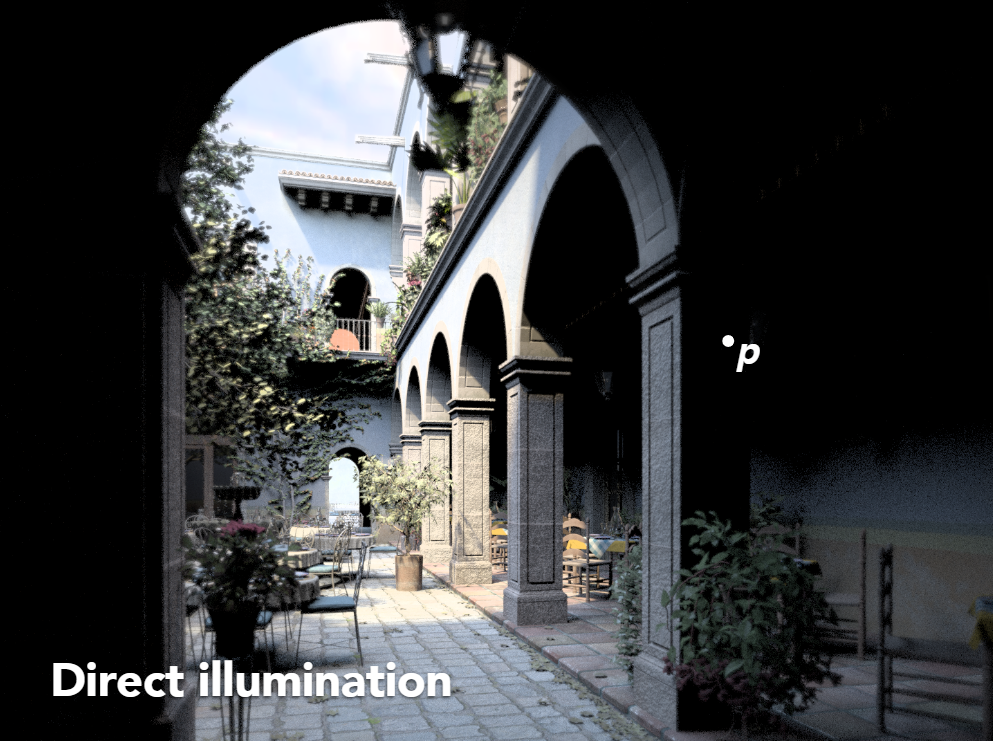
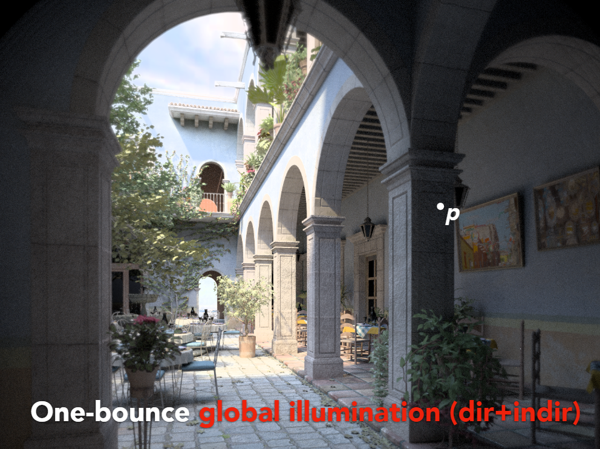
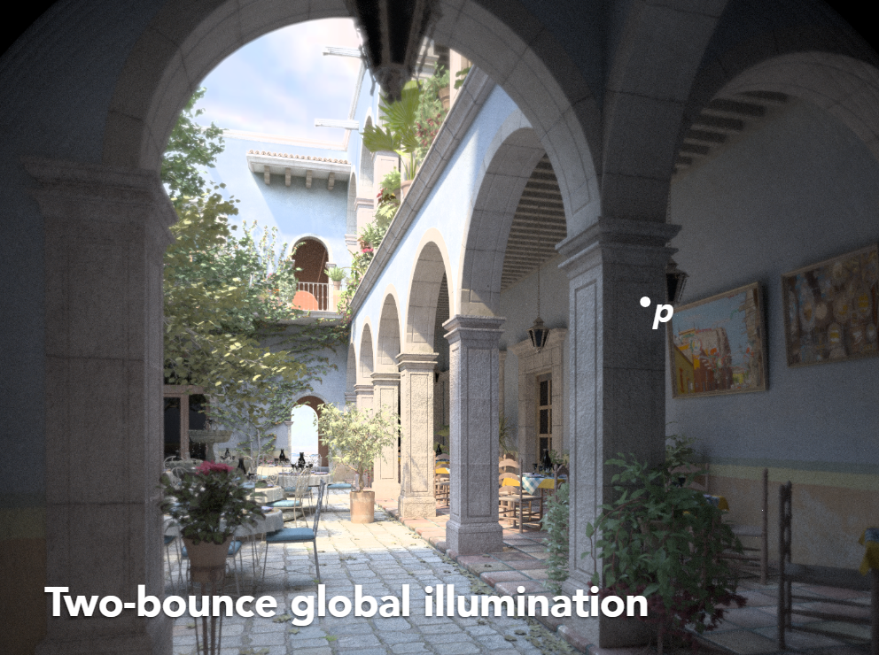
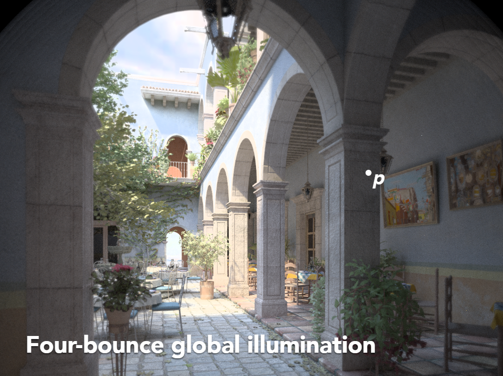

# 间接光照

## 间接光照的定义
先回顾一下渲染公式：
$$\Large L_r(X, \omega_r) = L_e(X, \omega_r) + \int_{\Omega}L_r(X', -\omega_i)f(X, \omega_i, \omega_r) \cos\theta_i d\omega_i$$
其中各项：
+ $L_r(x, \omega_r)$ 是反射光线，表示某一方向的渲染方程输出
+ $L_e(X, \omega_r)$ 是自发光项
+ $L_i(X', \omega_i)$ 是来自不同光源的直接照射或间接照射的光线
    + 点光源
    + 面光源
    + 其他物体反射光线
+ $f_r(X, \omega_i, \omega_r)$ 是 BRDF 项，表示光源到输出到这个方向的能量的贡献
+ $\cos\theta_i$ 是直射光线和法线夹角的余弦值

尝试解渲染方程

对于渲染方程 $L_r(x, \omega_r) = L_e(x, \omega_r) + \int_{\Omega} L_i(X', -\omega_i) f_r(x, \omega_i, \omega_r) \cos\theta_i d\omega_i$

我们不知道的项仅有 $L_r(X, \omega_r)$ 和 $L_i(X', -\omega_i)$

我们将渲染方程的式子简写为 $l(u) = e(u) + \int l(v) K(u, v) dv$

$u$ 表示物体本身， $v$ 表示来自光源， $K(u, v)$ 表示 BRDF 项

把 $\int ... K(u, v)dv$ 作为算子，记作 $K$ ，将渲染方程再次简写为 $L = E + KL$ ，其中 $L, E$ 是向量， $K$ 是矩阵

现在处理这个 $L = E + KL$， 将它写成 $L = (1 - K)^{-1}E$

将 $(1 - K)^{-1}$ 展开为 $(1 + K + K^2 + k^3 + ...)$ 最后得到方程 $L = E + KE + K^2E + K^3E + ...$

~~整个过程好像是由弗雷德霍姆积分方程和二项分布的性质进行推算得到的，具体推算过程暂时不了解~~

如何理解渲染方程：
$$\Large L = E + KE + K^2E + K^3E + ...$$
+ $E$ 表示物体的自发光
+ $KE$ 表示物体表面接收到的光源直射的光照
+ $K^2E$ 表示物体表面接收到的光线经过两次弹射所发出的光照
    + 为什么是弹射两次呢，因为该物体本身就需要占据一次弹射来将光线反射到我们眼睛里
+ $K^3E$ 表示物体表面接收到的光线经过三次弹射所发出的光照

由上述过程，可将物体表面的光照做如下分类：
自发光：物体自身发出的光线
直接光照：物体接收到的直接来自于光源照射的光线
间接光照：物体接收到的来自其他物体反射的光线，该反射得到的光线可能在物体间弹射多次

从渲染公式中得到间接光照的基本定义：**间接光照是物体接收到的来自其他物体反射的光线，该反射得到的光线可能在物体间弹射多次**

## 间接光照的效果
+ 直接光照
图中点 $P$ 没有光源直接照射，所以是黑色，表面它处于光源的阴影中

    

+ 直接光照 + 一次弹射间接光照（忽略物体自身占据的弹射次数）
图中点 $P$ 接收由周围物体弹射一次发射过来的光线，已经有基本的颜色

    

+ 直接光照 + 两次弹射间接光照（忽略物体自身占据的弹射次数）
图中点 $P$ 接收由周围物体弹射一次和弹射两次发射过来的光线，变得比前面更亮了一些

    

+ 直接光照 + 四次弹射间接光照（忽略物体自身占据的弹射次数）
图中点 $P$ 接收由周围物体弹射一次和弹射两次发射过来的光线，变得比前面更亮了一些
同时图里正上方的玻璃灯罩不再时黑色，因为两次弹射只让光线进入了玻璃灯罩，再经过两次弹射才会让光线出玻璃球，并射入我们的眼睛

    

观察后可以得出结论：随着间接光照的光线弹射次数的增多，物体变亮的程度逐渐变小，最后会趋于收敛（可忽略的极小值），符合能量守恒定律（弹射过程中能量逐渐损失）

