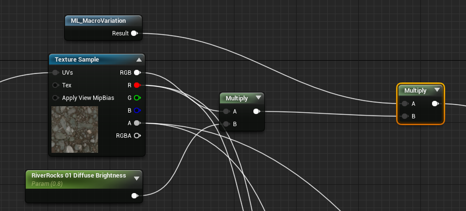

# water shader 分析

demo 来源：UE 商城免费项目 A boy and his kite（放风筝的男孩）
water shader address:ABoyandHisKite\Content\KiteDemo\Environments\Materials\M_TilingDisplacementTest_01.uasset

## 流程分析

### normal
+ 取水底的基础 normal ，采样水底法线贴图 T_Tile_PebblyRiverbank_N

`baseNormal = sample(T_Tile_PebblyRiverbank_N, screenUV / `**RiverRocks01Tiling**`) * const(1, 1, -1)`
    + T_Tile_PebblyRiverbank_N：提前准备好的水底法线贴图
    + **RiverRocks01Tiling**：水底法线采样缩放

+ 采样高低频的默认水法线贴图，并进行混合
    + 采样 FlowNormal贴图 计算UV
    
    `flowNormalUV = sample(T_GDC_TilingRocks_02_N, screenUV + `**FlowMipBias**`) * const(-1, 1, -1)`
    `flowNormalUV = flowNormalUV * Clamp(height * `**FlowmapDepth**`) * `**FlowMapAmt**
        + T_GDC_TilingRocks_02_N：水流法线贴图 / 流速图
        + **FlowMipBias**：采样水流法线贴图的固定偏移
        + **FlowmapDepth**：水体深度的乘因子
        + **FlowMapAmt**：UV的乘因子
    + 根据 flowNormalUV 和高低频法线贴图的缩放值计算出采样UV
    
    `texCoordOffset = Vec2(`**WaterTiling**`, `**WaterTiling**` / `**WaterAspectRatio**`)`
    ` `
    `highFrequenceNormalUV = higFrequenceTexCoord * texCoordOffset`
    `lowFrequenceNormalUV = higFrequenceTexCoord * texCoordOffset`
    ` `
    `highFrequenceSpeedUVOffset = speed * time * (PanDirection + const(-0.02, -0.02))`
    `lowFrequenceSpeedUVOffset = speed * time * (PanDirection + const(0.02, 0.02))`
    ` `
    `highFrequenceNormalUV = highFrequenceNormalUV + flowNormalUV + highFrequenceSpeedUVOffset`
    `lowFrequenceNormalUV = lowFrequenceNormalUV + flowNormalUV + lowFrequenceSpeedUVOffset`
    + 采样获取混合频率法线
    
    `highFrequenceNormal = sample(water_n, highFrequenceNormalUV)`
    `lowFrequenceNormal = sample(T_Water_N, lowFrequenceNormalUV)`
    `mixFrequenceNormal = (highFrequenceNormal + lowFrequenceNormal) * const(1, 0.5, 1)`
    `mxiBaseNormal = mixFrequenceNormal * `**WaterNormalStrength**
+ 根据深度和边缘对法线进行混合
    `normal = lerp(baseNormal, mixBaseNormal, clamp(height * `**WaterMaskEdgeMultiply**`))`
    + **WaterMaskEdgeMultiply**：水体边缘放大系数，用于处理边界
+ 根据深度叠加一个额外的moss normal
    `normal = lerp(normal, mossNormal * `**MossNormalStrength**`, clamp(height))`

### specular
+ 取水底的基础 diffuse ，采样水底法线贴图 T_Tile_PebblyRiverbank_D ，用 r 将预设的 specMin 和 specMax 混合

`baseSpecular = lerp(`**RiverRocks01SpecMin**`, `**RiverRocks01SpecMax**`, sample(T_Tile_PebblyRiverbank_D, screenUV / `**RiverRocks01Tiling**`).r)`
`baseSpecular = min(baseSpecular, 0.5)`

+ 根据水体边缘对高光进行两次衰减衰减

`specular = lerp(baseSpecular, 0.5, clamp(height * `**WaterMaskEdgeMultiply**`))`
`specular = lerp(specular, 0.255, clamp(height * `**WaterMaskEdgeMultiply**`))`
    + **WaterMaskEdgeMultiply**：水体边缘放大系数，用于处理边界

+ 根据深度叠加一个额外的moss normal
    `specular = lerp(specular, `**MossSpec**`, clamp(height))`

### roughness
+ 取水底的基础 diffuse ，采样水底法线贴图 T_Tile_PebblyRiverbank_D ，用 r 将预设的 RiverRocks01RMin 和 RiverRocks01RMax 混合

`baseRoughness = lerp(`**RiverRocks01RMin**`, `**RiverRocks01RMax**`, sample(T_Tile_PebblyRiverbank_D, screenUV / `**RiverRocks01Tiling**`).r)`

+ 顶点色的 b 分量叠加水底潮湿度和水的深度，并乘上边缘放大系数，得到水体粗糙度的插值比例

`wetnessAlpha = ((1 - VertexColor.b) + `**RockWetness**` + height) * `**WaterMaskEdgeMultiply**
`wetnessAlpha = clamp(0, 1, wetnessAlpha)`

+ 将预设的 WetRoughness 和 baseRoughness 进行叠乘
`roughness = baseRoughness * lerp(1, `**WetRoughness**`, wetnessAlpha)`

+ 根据 moss 的 diffuse.r 插值出 MossR ，根据 height 将 MossR 与 roughness 混合
`roughness = lerp(roughness, lerp(MossRMin, MossRMax, sample(T_ground_Moss_D, screenUV).r), clamp(height))`

### Displacement

### basecolor
+ 取水底的基础 diffuse ，采样水底法线贴图 T_Tile_PebblyRiverbank_D

`basecolor = sample(T_Tile_PebblyRiverbank_D, screenUV / `**RiverRocks01Tiling**`).rgb * `**RiverRocks01DifffuseBrightness**

+ 光照方向和水底 diffuse 算出水基础色的乘因子

`UVOffset = mixNormal * **Distortion** * lerp(1, FarDistBoost, (PixelDepth - FadeOffset) / FadeLength)`
`offset = height * **RiverBumpOffset** + screenUV * UVOffset`
`watercolorMultiply = 0.1 + 0.5 * （lightVector dot sample(T_ground_Moss_D, screenUV + offset).rgb）`
`watercolorMultiply = watercolorMultiply * (sample(T_ground_Moss_D, screenUV + offset).rgb * sample(T_ground_Moss_D, screenUV + offset).rgb)`

+ WaterColor 和 WaterColorDeep 混合水基础色

`waterColor = lerp(`**WaterColor.rgb**` * `**WaterColor.a**`, `**WaterColorDeep.rgb**` * `**WaterColorDeep.a**`, clamp(height * **WaterMaskEdgeMultiply**))`

+ 水基础色乘以乘因子后和水雾色插值
`waterColor = lerp(waterColor * watercolorMultiply, `**WaterFog.rgb**`, `**WaterFog.a**`)`
`factor = ExponentialDensity(clamp(hight * `**WaterColorGradientDepth**`), `**WaterColorDensity**`)`
`waterColor = lerp(waterColor, watercolorMultiply * `**RiverRocksUnderwaterDiffuseDarking**`, factor)`

+ 水底基础色和水面基础色插值
`BaseColor = lerp(basecolor, waterColor, clamp(height * WaterMaskEdgeMultiply))`

+ 根据 moss 的 DiffuseColor 和 FresnelColor 对 BaseColor 进行插值
`mossColor = lerp(MossDiffuseColor, MossFresnelColor, Fresnel) * sample(T_ground_Moss_D, screenUV + offset).rgb`
`BaseColor = lerp(BaseColor, mossColor, clamp(height))`

+ 基础色整体控制参数影响

`BaseColor = BaseColor * `**Brightness**` * other`

# 新版水体着色流程
### WaterColor / BaseColor
`waterColor = waterColor.rgb * waterColor.a * clamp(height)`
`bankColor = bankColor.rgb * bankColor.a * clamp(height)`
`baseColor = lerp(waterColor.rgb, frameBuffer * bankColor.rgb, clamp(height) * mixFactor)`
+ waterColor：基础水色，固定颜色，根据深度调节局部的水色透明度
+ bankColor：基础水底色，固定颜色，根据深度给frameBuffer中水底的颜色进行叠乘
+ mixFactor：用于调节整体水色和水底色混合的比例，这个比例要受到深度影响

### normal
+ UVTexCoord
`texCoordMultiply = vec2(WaterTiling, WaterTiling / WaterAspecRatio)`
`highFrequenceTexCoord = highFrequenceTexCoord * texCoordMultiply`
`lowFrequenceTexCoord = lowFrequenceTexCoord * texCoordMultiply`
    + TexCoord 是采样缩放比例，用来控制每个法线贴图的缩放

+ UVOffset
`highFrequenceUVOffset = speed * time * (PanDirection + const(-0.02, -0.02))`
`lowFrequenceUVOffset = speed * time * (PanDirection + const(0.02, 0.02))`
``

+ 高频混合
`highFrequenceNormal0 = sample(highFrequenceNormalMap, highFrequenceTexCoord0 * (screenUV + highFrequenceUVOffset0))`
`highFrequenceNormal1 = sample(highFrequenceNormalMap, highFrequenceTexCoord1 * (screenUV + highFrequenceUVOffset1))`
`highFrequenceNormal = lerp(highFrequenceNormal0, highFrequenceNormal1, highFrequenceMixFactor)`
    + 不同比例的UV采样同一张高频法线，然后根据 highFrequenceMixFactor 进行混合

+ 低频法线
`lowFrequenceNormal = sample(lowFrequenceNormalMap, lowFrequenceTexCoord * (screenUV + lowFrequenceUVOffset))`

+ 根据深度对高低频和顶点法线进行混合（水中心到岸边[1-0]）
    + 边缘(0.05-0)：顶点法线高权重
    + 岸边(0.3-0.05)：低频权重高
    + 深度水(1-0.3)：高低频混合权重高，提升高频权重
    + 根据深度判断是边缘还是岸边还是深度水

### specular

# 临时记录
[UE4 SingleLayerWater（文中简称水材质） 学习](https://zhuanlan.zhihu.com/p/373347686)
[UE4风格化水体制作](https://blog.csdn.net/Dreammingsox/article/details/123619805?spm=1001.2101.3001.6650.7&utm_medium=distribute.pc_relevant.none-task-blog-2%7Edefault%7EBlogCommendFromBaidu%7Edefault-7-123619805-blog-122396884.pc_relevant_multi_platform_whitelistv1&depth_1-utm_source=distribute.pc_relevant.none-task-blog-2%7Edefault%7EBlogCommendFromBaidu%7Edefault-7-123619805-blog-122396884.pc_relevant_multi_platform_whitelistv1&utm_relevant_index=10)
[UE4简单水体使用记录](https://blog.csdn.net/yycoolsam/article/details/122396884)
[UE4基于物理的着色(二) 菲涅尔反射](https://zhuanlan.zhihu.com/p/159140434)
[Adreno Profiler分析任意安卓游戏特效+抓取资源](https://qiankanglai.me/2015/05/16/Adreno-Profiler/)
[Android抓帧](https://zhuanlan.zhihu.com/p/127993920)
[如何查看安卓真机的渲染数据以及抓帧分析](https://blog.csdn.net/qq_37259196/article/details/115163405)
[UE5RayTracing篇(1)——NSight Graphics](https://zhuanlan.zhihu.com/p/525830336)