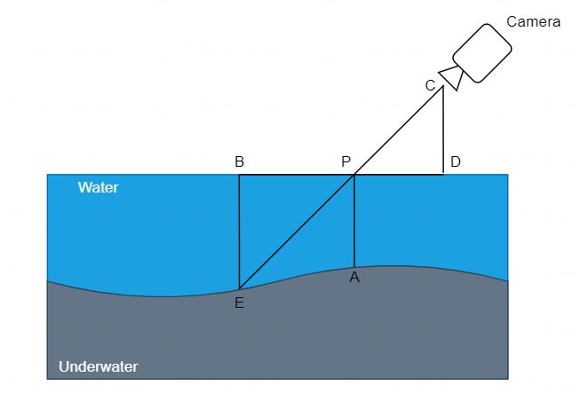
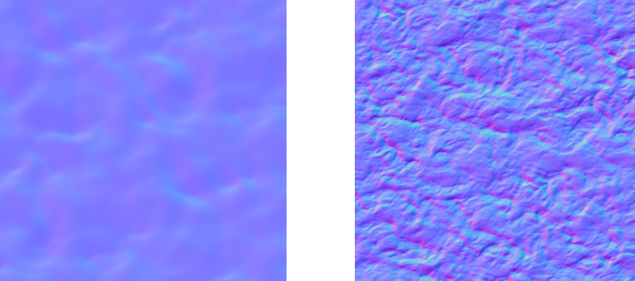

# Vern's Water Demo
我（Vern LH 我的英文名）的水体基本结构说明

## 整体效果
+ 不带高光

    

+ 带高光

    

## 水体分析
物理层面来说，就是一张平面的 mesh ，并且没有顶点动画（平面三角形面数少，没有曲面细分）

水体着色基本组成：
+ 水色：水体色，水雾色，水底色
+ 水面法线：波光粼粼的感觉，法线分布应该是起伏不同的波面
+ 透明度（不透明度）：不同水的透明度不同，不同深度的透明度不同
+ 水面高光：即水波对其他光线的反射
+ 水面反射：天空盒反射，SSR 反射
+ 折射：水底的物体扰动
+ 岸边处理
    + 岸边折射衰弱
    + 岸边白沫
    + 岸边的假波浪：可以观察到演示中的水体是有波浪的，这里时岸边处理的假波浪

## 基础说明
水体的偏物理的基础组成 —— 深度、法线和颜色
深度和法线是水本身偏物理的部分，深度表示了水体的体积信息，法线表示了水体的表面信息
颜色则表示水体基本的色彩，在剪除其他特性只留颜色的情况下，简单直观的表示水的基本色
### 深度
深度表示了水体表面某个着色 $P$ 的关于“垂直深度”和“视角深度”的物理信息

为什么要强调是水体表面？
答：因为水体使用的 mesh 是一个面片，并不是真实的体积水，我们需要在面片上表现水体深度的变化，就需要根据表面每个着色点不同的深度信息来改变着色点的具体数值

以下图为例，解释我对深度相关的定义与我在水体方面对深度的处理

这样一个简单的场景，由相机、水体和水底三个部分组成

先做定义，对于其中一个着色点 $P$ 来说
+ $AP$ 表示该点的垂直深度（或者说是绝对深度）
+ $EP$ 表示该点的视角深度（view direction）
+ 显然，相机垂直观察时，$AP = EP$
****
**垂直深度**
在拥有高度图的时候，直接用着色点的高度减去对应水底的高度图的值就可以得到
**视角深度**
表示在相机视角（观察方向）水体表面 $p$ 到延长线与水底交点 $E$ 的距离

$EP$ 还有一个特殊的物理意义，即水底反射的光线需要穿过水体到达相机的距离（光线在水下穿行的距离越长，能量散失越严重，颜色也就越暗淡）
****
但我实际并没有使用高度图，无法得到水体的绝对深度，所以使用 $EP$ 在 $Y$ 轴上的投影 $BE$ 来近似表示水体的绝对深度（水底越平滑，近似误差越小）

为什么要用 $BE$ 而不是 $EP$ 来代替 $AP$ ？
答：$PE$ 跟观察方向有关，观察角度一旦变化， $PE$ 的值变化比较剧烈，而 $BE$ 的变化就没有那么剧烈（除非水底高度变化较大）

看一下我对深度的处理
~~~hlsl
half GetWaterDepth(half pixelDepth, half2 screenUV, half3 worldPos)
{
    // 相似三角形算当前着色点水面的近似深度
    float screenDepth = SAMPLE_DEPTH_TEXTURE(_CameraDepthTexture, sampler_point_clamp, screenUV);
    screenDepth = LinearEyeDepth(screenDepth, _ZBufferParams);
    half waterViewDepth = abs(screenDepth - pixelDepth);
    half waterCameraDistance = distance(_WorldSpaceCameraPos.xyz, worldPosxyz);
    half waterCameraXZDistance = abs(_WorldSpaceCameraPos.y - worldPos.y);
    return waterCameraXZDistance * waterViewDepth / waterCameraDistance;
}
~~~

显然，图中可得 $\triangle BPE \sim \triangle CPD$ ，那么 $BE = \frac{CD}{CP} \cdot EP$

深度这里最后一点，尽管 $EP$ 有特殊的物理含义，我对水体颜色处理并没有使用它，而是使用 $BE$ 做处理

后文谈及的水体深度都为 $BE$ ，统称为深度（waterDepth）

### 法线
法线主要表示了水体表面的物理信息，它会被直接用于着色点的光照计算，也会参与反射折射等于表面效果相关的特性的计算

在物理世界中，水体有两种状态，相对静止状态和波动状态
+ 相对静止状态的水一般都是水壶或水杯内的对于我们而言没有任何波动的水体，这种情况不适合使用我所做的这个水体的着色模型
+ 另一种就是大自然场景的水，受空气流动（风）影响而又波浪的水体，湖泊、河流和海洋等等都属于这个范畴

对于波动的水而言，它的表面都是凹凸不平的、充满起伏的波，拥有特殊的、随机的法线分布（海洋等特殊的大波浪起伏不会改变法线的原始分布，而是改变 mesh ，即使是 mesh 呈现曲面状态，水体的微表面仍然需要特殊随机的法线分布）

常见的水体的法线贴图如下：

左边的法线分布较为平滑，没有尖锐的波形；右边的法线分布较为尖锐，分布不很平滑

给出我对法线的处理
~~~hlsl
// 高频法线
half2 highFrequencyUV0 = (i.worldPos.xz + _HFNormal0TexPanner.xy * _Time.xx) * _HFNormal0TexPanner.zw;
half2 highFrequencyUV1 = (i.worldPos.xz + _HFNormal1TexPanner.xy * _Time.xx) * _HFNormal1TexPanner.zw;
half3 highFrequencyNormal0 = UnpackNormal(SAMPLE_TEXTURE2D(_HighFrequencyNormalTex, sampler_HighFrequencyNormalTex, highFrequencyUV0)).xyz;
half3 highFrequencyNormal1 = UnpackNormal(SAMPLE_TEXTURE2D(_HighFrequencyNormalTex, sampler_HighFrequencyNormalTex, highFrequencyUV1)).xyz;
// 低频法线
half2 lowFrequencyUV = (i.worldPos.xz + _LFNormalTexPanner.xy * _Time.xx) * _LFNormalTexPanner.zw;
half3 lowFrequencyNormal = UnpackNormal(SAMPLE_TEXTURE2D(_LowFrequencyNormalTex, sampler_LowFrequencyNormalTex, lowFrequencyUV)).xyz;
half3 N = (highFrequencyNormal0 + highFrequencyNormal1) + lowFrequencyNormal;

N = normalize(WaterNormalT2W(N));
~~~

需要两张法线贴图，一张高频和一张低频
+ 对高频法线，按照不同缩放和偏移做两次采样，得到两个方向不同、大小不同的两个法线分布
+ 将两个法线分布做叠加得到高频叠加法线，目的是让水波有随机感
    如图，两次采样得到的高频法线图比较单调，需要进行叠加处理，得到有较强随机感（但本身连续）的法线分布

    

+ 对低频法线，按照设置的缩放和偏移（这里按照水流方向做大致设置）做一次采样，得到平滑波形的法线分布
    低频法线是水面整体性的法线分布，按照水流走向分布比较好
+ 将低频法线和高频叠加法线做混合得到最终的混合法线，目的是让水波有层次感，如图

    

最终得到了一个波形随机的法线分布，作为水表面的法线分布
### 基础色
+ 水体色：水体本身的颜色
+ 水雾色：水体色受到深度影响而累加（越深，水颜色越深）
+ 水底色：水底给一个假的固定色（光线穿过水体对水底造成的染色，会反过来影响水体本身的颜色显示，所有这里给一个固定的假的水底色来做对应的影响处理）
### 不透明度

## 特性说明
### 高光
### 假高光
### 天空盒反射
### 反射
### 岸边及泡沫
### 折射
### 波浪