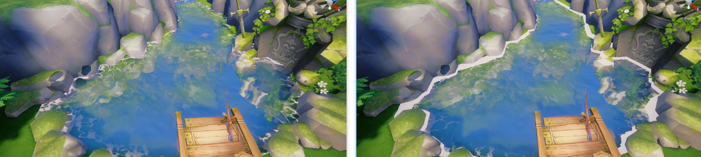

# Vern's Water Demo
我（Vern LH 我的英文名）的水体基本结构说明

## 目录
+ [整体效果](#整体效果)
+ [水体分析](#水体分析)
+ [基础说明](#基础说明)
    + [深度](#深度)
    + [法线](#法线)
    + [基础色](#基础色)
    + [不透明度](#不透明度)
+ [特性说明](#特性说明)
    + [高光](#高光)
    + [假高光](#假高光)
    + [反射](#反射)
        + [天空盒反射](#天空盒反射)
        + [SSR](#ssr)
        + [反射的效果](#反射的效果)
    + [岸边泡沫](#岸边泡沫)
    + [折射](#折射)
    + [波浪](#波浪)

## 整体效果
+ 不带高光

    

+ 带高光

    

## 水体分析
物理层面来说，就是一张平面的 mesh ，并且没有顶点动画（平面三角形面数少，没有曲面细分）

水体着色基本组成：
+ 水色：水体色，水雾色，水底色
+ 水面法线：波光粼粼的感觉，法线分布应该是起伏不同的波面
+ 透明度（不透明度）：不同水的透明度不同，不同深度的透明度不同
+ 水面高光：即水波对其他光线的反射
+ 水面反射：天空盒反射，SSR 反射
+ 折射：水底的物体扰动
+ 岸边处理
    + 岸边折射衰弱
    + 岸边白沫
    + 岸边的假波浪：可以观察到演示中的水体是有波浪的，这里时岸边处理的假波浪

## 基础说明
水体的偏物理的基础组成 —— 深度、法线和颜色
深度和法线是水本身偏物理的部分，深度表示了水体的体积信息，法线表示了水体的表面信息
颜色则表示水体基本的色彩，在剪除其他特性只留颜色的情况下，简单直观的表示水的基本色
### 深度
深度表示了水体表面某个着色 $P$ 的关于“垂直深度”和“视角深度”的物理信息

为什么要强调是水体表面？
答：因为水体使用的 mesh 是一个面片，并不是真实的体积水，我们需要在面片上表现水体深度的变化，就需要根据表面每个着色点不同的深度信息来改变着色点的具体数值

以下图为例，解释我对深度相关的定义与我在水体方面对深度的处理


这样一个简单的场景，由相机、水体和水底三个部分组成

先做定义，对于其中一个着色点 $P$ 来说
+ $AP$ 表示该点的垂直深度（或者说是绝对深度）
+ $EP$ 表示该点的视角深度（view direction）
+ 显然，相机垂直观察时，$AP = EP$
****
**垂直深度**
在拥有高度图的时候，直接用着色点的高度减去对应水底的高度图的值就可以得到
**视角深度**
表示在相机视角（观察方向）水体表面 $p$ 到延长线与水底交点 $E$ 的距离

$EP$ 还有一个特殊的物理意义，即水底反射的光线需要穿过水体到达相机的距离（光线在水下穿行的距离越长，能量散失越严重，颜色也就越暗淡）
****
但我实际并没有使用高度图，无法得到水体的绝对深度，所以使用 $EP$ 在 $Y$ 轴上的投影 $BE$ 来近似表示水体的绝对深度（水底越平滑，近似误差越小）

为什么要用 $BE$ 而不是 $EP$ 来代替 $AP$ ？
答：$PE$ 跟观察方向有关，观察角度一旦变化， $PE$ 的值变化比较剧烈，而 $BE$ 的变化就没有那么剧烈（除非水底高度变化较大）

看一下我对深度的处理
```hlsl
half GetWaterDepth(half pixelDepth, half2 screenUV, half3 worldPos)
{
    // 相似三角形算当前着色点水面的近似深度
    float screenDepth = SAMPLE_DEPTH_TEXTURE(_CameraDepthTexture, sampler_point_clamp, screenUV);
    screenDepth = LinearEyeDepth(screenDepth, _ZBufferParams);
    half waterViewDepth = abs(screenDepth - pixelDepth);
    half waterCameraDistance = distance(_WorldSpaceCameraPos.xyz, worldPosxyz);
    half waterCameraXZDistance = abs(_WorldSpaceCameraPos.y - worldPos.y);
    return waterCameraXZDistance * waterViewDepth / waterCameraDistance;
}
```

显然，图中可得 $\triangle BPE \sim \triangle CPD$ ，那么 $BE = \frac{CD}{CP} \cdot EP$

深度这里最后一点，尽管 $EP$ 有特殊的物理含义，我对水体颜色处理并没有使用它，而是使用 $BE$ 做处理

后文谈及的水体深度都为 $BE$ ，统称为深度（waterDepth）

### 法线
法线主要表示了水体表面的物理信息，它会被直接用于着色点的光照计算，也会参与反射折射等于表面效果相关的特性的计算

在物理世界中，水体有两种状态，相对静止状态和波动状态
+ 相对静止状态的水一般都是水壶或水杯内的对于我们而言没有任何波动的水体，这种情况不适合使用我所做的这个水体的着色模型
+ 另一种就是大自然场景的水，受空气流动（风）影响而又波浪的水体，湖泊、河流和海洋等等都属于这个范畴

对于波动的水而言，它的表面都是凹凸不平的、充满起伏的波，拥有特殊的、随机的法线分布（海洋等特殊的大波浪起伏不会改变法线的原始分布，而是改变 mesh ，即使是 mesh 呈现曲面状态，水体的微表面仍然需要特殊随机的法线分布）

常见的水体的法线贴图如下：


左边的法线分布较为平滑，没有尖锐的波形；右边的法线分布较为尖锐，分布不很平滑

给出我对法线的处理
```hlsl
// 高频法线
half2 highFrequencyUV0 = (i.worldPos.xz + _HFNormal0TexPanner.xy * _Time.xx) * _HFNormal0TexPanner.zw;
half2 highFrequencyUV1 = (i.worldPos.xz + _HFNormal1TexPanner.xy * _Time.xx) * _HFNormal1TexPanner.zw;
half3 highFrequencyNormal0 = UnpackNormal(SAMPLE_TEXTURE2D(_HighFrequencyNormalTex, sampler_HighFrequencyNormalTex, highFrequencyUV0)).xyz;
half3 highFrequencyNormal1 = UnpackNormal(SAMPLE_TEXTURE2D(_HighFrequencyNormalTex, sampler_HighFrequencyNormalTex, highFrequencyUV1)).xyz;
// 低频法线
half2 lowFrequencyUV = (i.worldPos.xz + _LFNormalTexPanner.xy * _Time.xx) * _LFNormalTexPanner.zw;
half3 lowFrequencyNormal = UnpackNormal(SAMPLE_TEXTURE2D(_LowFrequencyNormalTex, sampler_LowFrequencyNormalTex, lowFrequencyUV)).xyz;
half3 N = (highFrequencyNormal0 + highFrequencyNormal1) + lowFrequencyNormal;

N = normalize(WaterNormalT2W(N));
```

需要两张法线贴图，一张高频和一张低频
+ 对高频法线，按照不同缩放和偏移做两次采样，得到两个方向不同、大小不同的两个法线分布
+ 将两个法线分布做叠加得到高频叠加法线，目的是让水波有随机感
    如图，两次采样得到的高频法线图比较单调，需要进行叠加处理，得到有较强随机感（但本身连续）的法线分布

    

+ 对低频法线，按照设置的缩放和偏移（这里按照水流方向做大致设置）做一次采样，得到平滑波形的法线分布
    低频法线是水面整体性的法线分布，按照水流走向分布比较好
+ 将低频法线和高频叠加法线做混合得到最终的混合法线，目的是让水波有层次感，如图

    

最终得到了一个波形随机的法线分布，作为水表面的法线分布
### 基础色
+ 水体色：水体本身的颜色
+ 水雾色：水体色受到深度影响而累加（越深，水颜色越深）
+ 水底色：水底给一个假的固定色（光线穿过水体对水底造成的染色，会反过来影响水体本身的颜色显示，所有这里给一个固定的假的水底色来做对应的影响处理）

水底色存在的意义就是，模拟水体对水底有光线相关的影响后，反射到水面的光线对水面颜色呈现的影响。看上去有点绕，简单说就是水体影响水底，水底影响水面，我们把这一过程给简化为一个简单的水底色。

在我的实际处理中，用到了水体色和水底色混合得到水面的实际颜色，水雾色并没有直接使用。

先看一下我的处理
```hlsl
half waterHeight = GetWaterDepth(i.viewDepth, screenUV, i.worldPos.xyz);
half waterHeightFactor = waterHeight / _DepthMax;
half colorMixFactor = saturate(pow(waterHeightFactor, 0.6));

half3 waterColor = _WaterColor.rgb * _WaterColor.a;
half3 underWaterColor = _UnderWaterColor.rgb * _UnderWaterColor.a;
half3 baseColor = lerp(underWaterColor, waterColor, colorMixFactor);
```

`_DepthMax` 是我用来定义深水区域的，即水体深度决定水体色在水面颜色的占比
+ `waterHeight / _DepthMax > 1` ：水体深度超过 `_DepthMax` 就是深水区域，那么水面所呈现的颜色全部由水体色组成
+ `waterHeight / _DepthMax < 1` ：水体深度小于 `_DepthMax` 就是浅水区域，水体色的占比就由深度进行控制，越浅的水水体色占比就越小

以这样的方式来代替水雾色的效果，达到水深颜色深的水雾效果

按道理说，水底色也应该影响水底的颜色，但是为什么不用水底色去实际处理水底的颜色呢？
答：但是水底色和水体色混合后为水面颜色，最终会和水底的颜色进行混合，所以水底色最终会影响水底的颜色

看一下效果
+ 深水 `_DepthMax = 5.0`

    

+ 浅水 `_DepthMax = 0.1`

    


### 不透明度
不透明度，很直观就是 $1 - alpha$ ，表示水体这个半透明物体与水底的颜色混合的最终混合比例

看一下我的处理
```hlsl
half waterHeight = GetWaterDepth(i.viewDepth, screenUV, i.worldPos.xyz);
half depthFade = saturate(waterHeight / _DepthFade);
float fresnel = Fresnel(0.04, 5, NoV);
half opacity = saturate(pow(waterHeightFactor, 0.2) + fresnel) * depthFade;
```

水体的透明度（不透明度）由两个基本项组成
+ 岸边深度占比：这里表示水体深度在设置的最大岸边深度的占比，岸边的不透明度应该比较小，深水区域应该就由完全看不到水底
+ 菲涅尔项：物理意义上的菲涅尔影响，角度对观察的影响，对水体来说会体现在透明度上

对我的水体不透明度处理的说明
+ `0.04` 是光线在水体与空气两种介质的反射折射比率，是一个定值，不建议修改
+ `5` 是菲涅尔近似式子的标准乘方数，也不建议修改（或改为3）
+ [点击了解菲涅尔项](https://github.com/HL0817/Games101Notes/blob/main/Notes/17_Materials_and_Appearances/Materials_and_Appearances.md#%E8%8F%B2%E6%B6%85%E8%80%B3%E9%A1%B9)


在基础说明中，不透明度的处理暂时到此为止，后续其他特性会对不透明度的使用和修改

有个遗留问题，我直接将岸边深度占比和菲涅尔项直接加起来作为水体的不透明度，但是感觉不太合理，暂时就这么处理吧

## 特性说明
基础之外，就是给是加各种效果了，给水附加细节，细节拉满效果才能逼真一些

### 高光
水面也是有高光的，我是按照 PBR 的高光计算来处理水体表面的直接光的高光

```hlsl
float3 UE_CookTorranceBRDF(float NoV, float NoL, float NoH, float VoH, float roughness, float3 specularColor)
{
    float roughness2 = roughness * roughness;
    float roughness4 = roughness2 * roughness2;

    NoV = saturate(abs(NoV) + 1e-5);

    float D = (NoH * roughness4 - NoH) * NoH + 1;
    D = roughness4 / (PI * D * D);

    float V_SimthV = NoL * (NoV * (1 - roughness2) + roughness2);
    float V_SimthL = NoV * (NoL * (1 - roughness2) + roughness2);
    float Vis = 0.5 * rcp(V_SimthV + V_SimthL);

    float Fc = pow(1 - VoH, 5);
    float3 F = Fc + (1 - Fc) * specularColor;

    float3 directlightSpec = (D * Vis) * F;
    return directlightSpec;
}

...

float specular = 0.04;
half3 specularColor = _SpecularColor.rgb * _SpecularColor.a;
half3 dirSpecularColor = _DirSpecularIntensity * specular * UE_CookTorranceBRDF(NoV, NoL, NoH, VoH, _DirSpecularRoughness, specularColor);
```

说明
+ `UE_CookTorranceBRDF` 使用的是 UE 的 BRDF 高光部分计算的流程
+ `specular` 固定为 0.04
+ `roughness` 主要影响高光的范围

需要注意一点，很多水在加入高光之后很油，就像表面漂浮着一层油，这是高光计算时粗糙度设置得太大了，导致高光既弱又分散


左图的高光就像是油一般，看着有点腻，右边就相对真实一点，高光比较集中，只有在水波的波峰附近才有

这里还有一个风格的问题，写实一点的水才适合右图的高光，这样比较真实；而卡通风格的话就要令做考虑了

### 假高光
假高光是对高光的补充

我们的观察方向如果在直接光的出射方向附近角度才能观察到高光的存在，而假高光就是模拟不论我们在什么角度都能看到的较弱的高光，它的强度小于直接光的高光

处理如下
```hlsl
float3 UE_SampleBRDF(float3 N, float3 V, float3 L, float roughness4, float3 specularColor)
{
    float NoV = saturate(dot(N, V));
    float3 H = normalize(V + L);
    float NoH = saturate(dot(N, H));

    float D = (NoH * roughness4 - NoH) * NoH + 1;
    D = roughness4 / (PI * D * D);

    float Vis = 0.25;

    float3 F = specularColor;
    return D * Vis * F;
}

...

// 给水面一个假的光照，来模拟非直接光产生的高光
// UNITY_MATRIX_V[0] = camera's RightUnitVector in world space
// UNITY_MATRIX_V[1] = camera's UpUnitVector in world space
// UNITY_MATRIX_V[2] = camera's ForwardUnitVector in world space
half3 cameraLookAt = UNITY_MATRIX_V[2].xyz;
half3 envLightDirection = reflect(-cameraLookAt, half3(0, 1, 0));
half3 envSpecularColor = _EnvSpecularIntensity * specular * UE_SampleBRDF(N, VenvLightDirection, pow(_EnvSpecularRoughness, 4), specularColor);
```

假高光的效果，可以看文章开头的带高光的效果

最后看一下如何使用我计算得到的高光，specular 和 diffuse 两类光加起来和和直接光作用
```hlsl
half atten = mainLight.distanceAttenuation * mainLight.shadowAttenuation * max(NoL,0);
half3 mainLightColor = mainLight.color * atten;
half3 color = (baseColor.rgb + dirSpecularColor + envSpecularColor) * mainLightColor + baseColor  * ambientColor;
```
+ baseColor 水体色和水底色混合得到的基础色
+ dirSpecularColor 直接光高光
+ envSpecularColor 假高光

### 反射
反射有两种
+ 天空盒
+ SSR

我是让这两种反射互补，如果没有 SSR 反射的地方就用天空盒，最后使用反射颜色做进一步处理，处理如下

```hlsl
half3 reflectColor;

... \\ 选择使用天空盒还是 SSR 反射

color = color / 2 + color * reflectColor + reflectColor;
```

#### 天空盒反射
天空盒一般就是 cubemap 直接根据反射采样就可以

```hlsl
half3 skyBoxNormal = normalize(half3(N.x * _SkyBoxDistort, 1, N.z * _SkyBoxDistort));
half3 skyColor = DecodeHDREnvironment(SAMPLE_TEXTURECUBE(_SkyBoxTex, sampler_SkyBoxTex, reflect(-V, skyBoxNormal)), _SkyBoxTex_HDR).rgb;
skyColor = skyColor * _SkyBoxColor.rgb * _SkyBoxColor.a;
```

可以直接使用之前计算出来的 N 作为法线采样（N 是具有随机性的，带有扭曲），也可以额外为天空盒增加扰动来产生更大的扭曲

#### SSR
屏幕空间 Ray Marching ，原理就不提了，后面有时间单独说一下

为什么不使用 SSPR ？
答：手机可能不支持 CS ，所以都用 SSR 了

处理过程如下
```hlsl
half2 ViewPosToCS(half3 vpos)
{
    half4 proj_pos = mul(unity_CameraProjection, half4(vpos, 1));
    half3 screenPos = proj_pos.xyz / proj_pos.w;
    return half2(screenPos.x, screenPos.y) * 0.5 + 0.5;
}

half compareWithDepth(half3 vpos)
{
    half2 uv = ViewPosToCS(vpos);
    float depth = SAMPLE_TEXTURE2D(_CameraDepthTexture, sampler_point_clamp, uv);
    depth = LinearEyeDepth(depth, _ZBufferParams);
    int isInside = uv.x > 0 && uv.x < 1 && uv.y > 0 && uv.y < 1;
    return lerp(0, vpos.z + depth, isInside);
}

bool RayMarching(half3 o, half3 r, out half2 hitUV)
{
    half3 end = o;
    half stepSize = 2;
    half thinkness = 1.5;
    half triveled = 0;
    int max_marching = 256;
    half max_distance = 500;

    UNITY_LOOP
    for (int i = 1; i <= max_marching; ++i)
    {
        end += r * stepSize;
        triveled += stepSize;

        if (triveled > max_distance)
            return false;

        half collied = compareWithDepth(end);
        if (collied < 0)
        {
            if (abs(collied) < thinkness)
            {
                hitUV = ViewPosToCS(end);
                return true;
            }

            //回到当前起点
            end -= r * stepSize;
            triveled -= stepSize;
            //步进减半
            stepSize *= 0.5;
        }
    }
    return false;
}

// SSPR
    half3 rayOrigin = TransformWorldToViewDir(i.worldPos.xyz - _WorldSpaceCameraPo    xyz);
    half3 SSPRNormal = normalize(half3(N.x * _SSPRDistort, 1, N.z * _SSPRDistort));
    half3 viewSpaceNormal = TransformWorldToViewDir(SSPRNormal);
    half3 reflectionDir = normalize(reflect(rayOrigin, viewSpaceNormal));
    half2 hitUV = 0;
    if (RayMarching(rayOrigin, reflectionDir, hitUV))
    {
        reflectColor = SAMPLE_TEXTURE2D(_CameraOpaqueTextur        sampler_CameraOpaqueTexture, hitUV).xyz;
        reflectColor = reflectColor * _SSPRColor.rgb * _SSPRColor.a;
    }
```

#### 反射的效果


### 岸边泡沫
岸边处理，除了之前我根据岸边深度计算不透明度以外，还需要泡沫（泡沫一般看风格，偏写实的话可能不用泡沫）


使用一张泡沫的贴图来模拟岸边水体冲击形成的白沫

处理过程如下
```hlsl
// Foam
half foamAlpha = SAMPLE_TEXTURE2D(_FoamTex, sampler_FoamTex, N.xz).r;
half foamFade = waterHeight / _FoamFade;
half foam_cutoff = pow(saturate(foamFade), _FoamFadePow) - step(foamFade, _FoamHeadWidth);
half foamFactor = smoothstep(foam_cutoff, foam_cutoff + _FoamBlur, foamAlpha);
foamFactor = saturate(foamFactor * _FoamColor.a);
color = lerp(color, _FoamColor.rgb, foamFactor);
opacity = 1 - (1 - opacity) * (1 - foamFactor);
```

+ `_FoamFade` 泡沫宽度，调节边缘泡沫的范围
+ `_FoamFadePow` 泡沫边缘增加，作为 `foamFade` 的乘方，更高精度的调节边缘范围，同时使靠近边缘的泡沫更明显（小于 1 的乘方，会放大小于 0 的数）
+ `_FoamHeadWidth` 泡沫靠近岸边侧的白边，调整白边宽度，使用 `-step(foamFade, _FoamHeadWidth)` 来调节一定范围内的白沫区域的值，最终作用到透明度上
+ `_FoamBlur` 泡沫软边，减弱泡沫靠近水体侧的透明度（越靠近岸边，泡沫应该越明显，对应就是透明度越高）
    + 使用泡沫图来对计算的 `foam_cutoff` 做插值，泡沫图的特点就是边缘值小中间值答，这样做就能加强非边缘的 `foam_cutoff`

看一下效果
+ `_FoamFade` 0.5 vs 1.0

    

+ `_FoamFadePow` 0.5 vs 1.0
    注意边缘衰减，当 `_FoamFadePow` 小时，衰减更明显

    

+ `_FoamHeadWidth` 0 vs 0.2

    

+ `_FoamBlur` 0.01 vs 0.5
    明显的衰减效果

    

### 折射
折射，即水下的物体从视角看上去有偏移。但对于自然界的水而言，水下物体会呈现扭曲扰动的状态，因为水面是非静止的，光线折射后水下物体就是扰动的

折射被拆解为了，水下物体的扰动

先看一下效果，给一个比较夸张折射率


我是怎么处理的
```hlsl
float2 RefractionUVOffset(half3 N, half depthFade)
{
    half3 ViewNormal = mul(GetWorldToViewMatrix(), N);
    half3 ViewVertexNormal = mul(GetWorldToViewMatrix(), half3(0, 1, 0));
    float2 DistortionUV = (ViewVertexNormal.xz - ViewNormal.xz) * (lerp(1, _Refraction, depthFade) - 1);
    float InvTanHalfFov = UNITY_MATRIX_P[0].x;
    float Ratio = _ScreenParams.x / _ScreenParams.y;
    float2 FovFix = float2(InvTanHalfFov, Ratio * InvTanHalfFov);
    DistortionUV = DistortionUV * (_ScreenParams.xy * float2(0.00023, -0.00023) * FovFix);
    return DistortionUV;
}

// Refraction
float2 refractionUVOffset = RefractionUVOffset(N, depthFade);
float2 DistortUV = screenUV + refractionUVOffset * saturate(waterHeight);
half3 DistortOpaqueColor = SAMPLE_TEXTURE2D(_CameraOpaqueTexturesampler_CameraOpaqueTexture, DistortUV);

color = color * opacity + DistortOpaqueColor.xyz * (1 - opacity);
```

水体本来是半透明物体，在绘制完成后会与 framebuffer 中存储的不透明物体的渲染结果做 alpha blend

这样的流程是无法完成不透明物体渲染结果扰动的（除非你改了管线，在水体半透明绘制 pass 结束后先不做 alpha blend ，先搞个 pass 提前把水底的不透明物体渲染结果给扰动了）

我改变了水体半透明 alpha blend 的设置 `Blend One Zero` ，选择水与不透明渲染结果不做混合

在绘制水的最后，手动采集对应屏幕空间 uv 的不透明渲染结果（水底的色彩）做扰动，然后手动混合到水面的颜色中（Unity.URP 管线使用 _CameraOpaqueTexture 就 OK）

顺便说一句，UE 就是单独的 3 个 pass 来完成水的折射
+ 水面颜色及效果计算 pass
+ 水底扰动 pass
    + drawcall 1：根据水体的 mesh 生成对应范围的扰动图
    + drawcall 2：在水体的对应范围，将扰动图应用到前面绘制出来的 SceneColor 上，生成只有水体范围的扰动结果图
    + drawcall 3：将扰动结果图合并到 SceneColor 上去
+ 组合半透明物体

### 波浪
做波浪一般使用曲面细分+ Genstner wave 的方法，实际的对渲染时的 mesh（顶点）做了偏移，来模拟波浪

类似于这种，使用 $\sin \cos$ 来模拟波浪变化


然后将模拟结果放到细分后的顶点的位移项上去

对于手机而言，大部分都没有性能来开启曲面细分，所以我使用了一个比较取巧的方法来模拟岸边的波浪，先看一下效果


用来模拟海浪冲击沙滩，效果也不错

处理过程如下
```hlsl
// wave: fake water height 
half perlinNoise = SAMPLE_TEXTURE2D(_WaveRandomMap, sampler_WaveRandomMap, N.xz * _WaveRandomMap_ST.xy + _WaveRandomMap_ST.zw).r;
half waveTime = _Time.y * _WaveLoopSpeed + perlinNoise * PI * 2 * _WaveLoopRandom;
half depthOffset = perlinNoise * 0.01 + _WaveLoopPower * (sin(waveTime) * 0.5 + 0.5);

...
waterHeight = saturate(waterHeight - depthOffset);
...
opacity = opacity * step(0.001, waterHeight);
```

让水面的深度有一个我手动计算生成的偏移，周期性的减小，从而周期性的影响水面的高度和不透明度

需要注意一点，我们有一些对水面下的处理，如果波浪使原本水面下的物体暴露出来了，就需要把一些效果给去掉（比如折射的扰动）